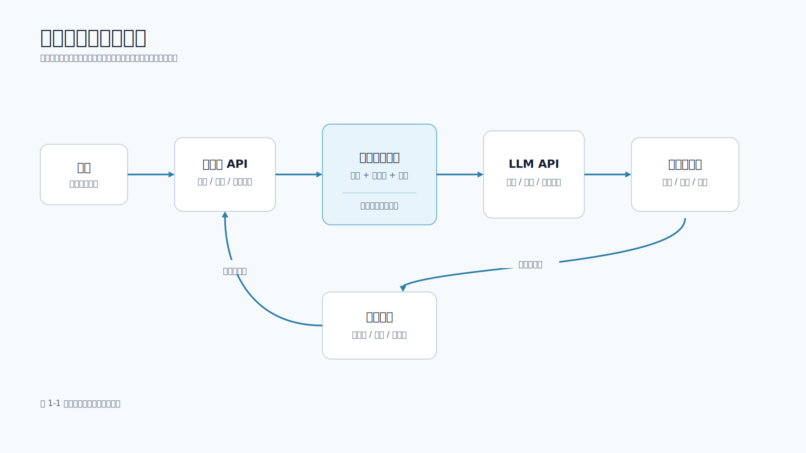

# 第 1 章 认识大模型

## 本章导读

大模型不是一个简单的“聊天接口”，也不是可以替代所有业务代码的万能服务端。更准确地说，它是一类通过大量文本、代码和多模态数据训练出来的基础能力：给定一段输入上下文，它会预测接下来最可能出现的内容，并在这个过程中表现出理解、归纳、改写、推理、代码生成和工具选择等能力。

移动端开发者接触大模型时，最容易遇到两个误区。第一个误区是把模型当作普通 REST API，只关心如何发请求、拿响应；第二个误区是把模型当作会自己理解业务规则的智能后端，直接让它决定订单、权限、支付、删除等动作。这两种理解都不够工程化。大模型应用真正要做的是：把模型能力放进可控的软件链路中，让客户端、服务端、业务系统和模型各自承担清晰职责。

图 1-1 展示了一次典型的大模型应用调用链路。



本章先建立全书的基础认知：大模型怎样生成答案，它为什么看起来会“理解”和“推理”，一次移动端请求如何进入模型链路，哪些事情应该由模型做，哪些事情必须留在服务端业务代码中。理解这些边界后，后续学习提示词、API、RAG（检索增强生成）、Agent（能按步骤调用工具的应用模式）、安全和综合项目时，读者就不会只停留在“调一个接口”的层面。

## 学习目标

- 理解大模型的基本工作方式：Token（模型处理文本的基本片段）、上下文窗口、下一 Token 预测和采样。
- 区分模型能力、应用逻辑、业务系统和移动端 UI 的职责边界。
- 了解一次大模型请求从用户输入到业务响应的完整流程。
- 能够解释为什么移动端不应直接保存模型 API 密钥。
- 能够运行本书配套工程中的本地知识助手，看到一次真实的检索、提示词构造和模型响应链路。

## 核心内容

### 1.1 大模型不是规则引擎

传统 App 功能通常是确定性的。用户点击“保存”按钮，客户端校验表单，服务端检查权限和参数，然后写数据库并返回结果。只要输入、状态和代码版本相同，输出就应该相同。

大模型应用不同。开发者不再穷举所有自然语言规则，而是把任务、上下文和约束组织成提示词（Prompt），交给模型生成一个概率上合适的结果。它可以处理“帮我总结这段反馈”“把日志整理成工单”“解释这份接口文档”等开放任务，但它的输出天然带有概率性：同一个问题，在不同模型、不同参数、不同上下文下，可能生成不同表达。

这并不意味着软件工程失效。相反，大模型应用更需要工程约束。业务系统仍然负责权限、数据、事务、日志、审计和异常处理；大模型只负责处理那些难以用固定规则描述的语言理解与生成任务。

可以把大模型看作一种能力组件：

| 维度 | 传统规则代码 | 大模型能力 |
| --- | --- | --- |
| 输入 | 结构化参数、明确状态 | 自然语言、文档、日志、图片描述、上下文片段 |
| 输出 | 确定字段、确定状态 | 候选答案、结构化草稿、分类结果、工具调用建议 |
| 优势 | 稳定、可测试、可审计 | 能处理非结构化信息，能归纳和生成 |
| 风险 | 规则覆盖不全时代码变复杂 | 可能幻觉、格式漂移、越权理解、泄露上下文 |
| 工程边界 | 业务规则由代码执行 | 模型输出必须被服务端校验后才能进入业务动作 |

移动端团队尤其要记住一点：模型可以参与生成“建议”，但不应该直接拥有“执行权”。例如模型可以建议“这个退款请求需要人工复核”，但是否真的退款，必须由服务端规则、权限和人工确认决定。

### 1.2 从 Token 到答案

大模型生成答案的基本单位不是汉字、单词或句子，而是 Token。Token 可以理解为模型内部处理文本的片段。中文里一个 Token 可能对应一个字、一个词的一部分或一段常见符号；英文里一个 Token 可能对应一个单词、词根或标点组合。不同模型的切分方式不完全相同，但工程含义一致：模型看到的上下文长度、调用成本和生成长度，通常都按 Token 计量。

一次文本生成可以简化为 5 步：

1. 服务端把系统规则、用户问题、检索资料和输出要求组装成模型输入。
2. 模型把输入切分为 Token，并放入上下文窗口。
3. 模型根据已有 Token 计算下一个 Token 的概率分布。
4. 采样策略从候选 Token 中选择一个输出。
5. 新 Token 被追加到上下文中，模型继续预测下一个 Token，直到达到停止条件。

这里最关键的是第 3 步：模型不是从数据库里查出一个完整答案，而是在上下文约束下不断预测“接下来更可能出现什么”。当输入中包含“请用 JSON 输出字段 summary、risks”，模型就更倾向于生成这些字段；当输入中包含无关或恶意上下文，模型也可能受到干扰。这就是提示词工程、RAG 权限过滤和输出校验的重要性。

移动端体验和 Token 机制也直接相关：

- 上下文越长，请求成本越高，首 Token 延迟越可能增加。
- 输出越长，流式渲染越重要，否则用户会长时间看着加载状态。
- 采样温度越高，回答越发散；温度越低，回答越稳定但可能更机械。
- 如果把整个聊天历史都塞进上下文，既浪费成本，也可能把旧状态误带入新任务。

第 2 章会继续展开上下文窗口、温度、Top-K（只从概率最高的一批候选中采样）、Top-P（从累计概率达到阈值的一批候选中采样）和幻觉。本章先建立直觉：模型生成答案的过程更像“在上下文约束下逐步写出最可能的下文”，而不是“执行一段确定性业务逻辑”。

### 1.3 为什么模型看起来会理解和推理

从机制上看，大模型训练时学习的是大量语料中的模式：词语之间的关系、代码结构、问答格式、推理步骤、文档风格和常见任务解法。经过预训练、指令微调和对齐训练后，模型学会了按人类指令组织回答，因此它看起来会理解问题、补全逻辑、生成步骤甚至写代码。

这个能力很有价值，但也需要谨慎解释。

第一，模型没有天然连接你的业务数据库。它不知道用户是否有权限、订单是否存在、接口是否已经改版，除非服务端把这些事实提供给它。

第二，模型不会自动遵守你们公司的业务规则。规则必须写进服务端代码、提示词约束或工具白名单中，并在模型输出后再次校验。

第三，模型的回答可能流畅但错误。流畅表达不等于事实正确。移动端页面如果直接展示模型生成的“确定结论”，很容易误导用户。

第四，模型不会自动知道客户端状态。当前页面、网络状态、登录身份、灰度开关、App 版本、设备权限等信息，必须由移动端或服务端显式提供，并且只提供完成任务所需的最小信息。

因此，一个可靠的大模型应用通常不会问“模型能不能直接完成全部任务”，而会问：

- 这个任务中哪部分适合模型处理？
- 模型需要哪些上下文？
- 哪些上下文不能给模型？
- 模型输出应该由谁校验？
- 哪些动作必须由服务端代码或人工确认执行？

这种拆分方式比“让模型更聪明”更重要。模型能力会持续变化，但边界设计、权限控制和错误兜底是工程系统长期稳定的基础。

### 1.4 大模型应用的基本组成

一个典型的大模型应用通常包含 6 个部分：

| 组成部分 | 职责 | 移动端关注点 |
| --- | --- | --- |
| 移动端 App | 接收用户输入，展示模型输出，处理加载、取消、重试和错误态 | 流式渲染、弱网、页面状态、隐私授权 |
| 服务端 API | 处理会话、权限、业务规则、密钥保护和限流 | 移动端只调用自有服务端，不保存模型密钥 |
| 提示词构造器 | 把用户问题、系统规则、上下文和输出格式组装为模型输入 | 输出字段要能映射到页面组件 |
| 检索或业务上下文 | 提供模型回答所需的事实来源 | 无权资料不能进入模型上下文 |
| 模型服务 | 生成文本、结构化输出或工具调用建议 | 关注延迟、错误、成本和流式能力 |
| 结果解析器 | 校验模型输出格式，转换为业务可用数据 | 枚举、空值、错误态和人工复核入口 |

其中，提示词构造器和结果解析器是大模型应用区别于普通 API 应用的关键。前者决定模型看到什么，后者决定模型输出能不能被系统可靠消费。移动端开发者不一定亲自实现模型网关，但必须理解这两个环节，否则很难设计稳定的页面状态。

例如一个“接口文档总结”功能，移动端不能只期待服务端返回一段自由文本。更稳妥的做法是让服务端返回：

```json
{
  "summary": "接口用于提交移动端反馈。",
  "mobile_steps": ["获取用户授权", "提交问题描述", "展示工单编号"],
  "risks": ["不要在客户端保存模型 API 密钥"],
  "citations": [
    {"title": "移动端 AI 接入指南", "section": "API Key 管理"}
  ]
}
```

这样页面可以稳定渲染摘要、步骤、风险提示和引用来源。如果模型输出缺少字段，服务端可以返回错误或兜底结构，而不是让移动端在一段自然语言里猜。

### 1.5 一次完整调用流程

用户在页面输入“帮我总结这份接口文档的重点”。一个工程化系统通常不会把这句话原样丢给模型，而是经历如下步骤：

1. 移动端把用户问题、页面场景和请求 ID 发送给自有服务端。
2. 服务端检查用户登录态、租户、文档权限和调用额度。
3. 服务端读取文档内容，或检索与问题最相关的片段。
4. 服务端构造提示词，写入任务、上下文、约束和输出格式。
5. 服务端调用模型服务，必要时使用流式接口降低等待感。
6. 服务端解析模型结果，检查 JSON 字段、引用来源和风险词。
7. 服务端把稳定结构返回给移动端。
8. 移动端根据字段更新页面状态：加载中、部分输出、完成、失败、可重试或需要人工确认。

> **重点提示**：大模型只是工程系统中的一个能力节点。真正的产品体验来自整条链路：权限是否正确，资料是否给对，提示词是否清楚，模型调用是否稳定，输出是否可解析，移动端是否能处理取消、弱网和失败。图 1-1 中的业务系统既会在模型调用前提供检索资料和事实依据，也会在模型输出被校验后接收工单、记录、任务等业务写入；它不是只在模型回答之后才参与。

如果把模型直接暴露给移动端，会出现几个严重问题：

- API 密钥可能被反编译或抓包提取。
- 无法统一做权限、限流、审计和成本控制。
- 无法在服务端隐藏提示词模板和业务规则。
- 无法集中处理模型供应商切换、重试、降级和错误码。
- 用户输入可能直接进入模型，缺少脱敏和风险过滤。

因此，本书后续所有实践都采用同一个基本架构：移动端调用自有服务端，自有服务端调用模型或模型网关。

### 1.6 动手实践：运行一次本地知识助手

下面示例直接使用本书配套工程，不需要真实模型 API 密钥。它会读取本地 Markdown 文档，检索相关片段，用 `MockLLMProvider` 生成稳定答案，并返回引用来源。

进入示例工程：

```bash
cd examples/mobile-knowledge-assistant
PYTHONPATH=src python3 - <<'PY'
from pathlib import Path
import json

from mobile_llm.providers import MockLLMProvider
from mobile_llm.retriever import LocalRetriever
from mobile_llm.service import KnowledgeAssistant

retriever = LocalRetriever.from_directory(Path("data/documents"))
assistant = KnowledgeAssistant(retriever, MockLLMProvider())

result = assistant.answer("移动端为什么不能直接保存模型 API 密钥？")
print(json.dumps(result, ensure_ascii=False, indent=2))
PY
```

这段代码不是伪代码，它会真实运行本地检索和知识助手服务层。当前示例数据的一次输出节选如下。为节省版面，只保留第一条引用；实际运行会返回多条 `citations`，`score` 也会随检索实现和文档内容变化。

```json
{
  "answer": "根据《移动端 AI 接入指南》的“API Key 管理”部分，移动端 App 不应该直接保存模型 API Key...",
  "citations": [
    {
      "source": "mobile_ai_api.md",
      "title": "移动端 AI 接入指南",
      "section": "API Key 管理",
      "text": "移动端 App 不应该直接保存模型 API Key。客户端包可以被反编译，抓包工具也可能暴露请求内容。推荐做法是 App 调用自有服务端 API，由服务端保存模型密钥并调用大模型服务。",
      "score": 0.3712
    }
  ]
}
```

这个结果里有两个重要信息。`answer` 是模型能力生成的文本，`citations` 是服务端检索到的引用来源。移动端页面不应该只展示回答本身，还应在需要时展示引用卡片、低置信度提示或“资料不足”的状态。

从代码路径看，`assistant.answer()` 内部经历了 4 个步骤：

| 代码位置 | 作用 | 工程含义 |
| --- | --- | --- |
| `LocalRetriever.search()` | 从 `data/documents/` 中检索相关片段 | 决定模型能看到哪些事实来源 |
| `build_rag_messages()` | 构造 system/user messages | 把任务、资料和边界写进提示词 |
| `MockLLMProvider.generate()` | 根据检索片段生成稳定答案 | 在无真实密钥时仍能跑通模型调用边界 |
| `_citation()` | 返回来源、标题、章节、原文和分数 | 让移动端能展示引用来源和排查依据 |

这张对照表的重点不是让读者立即掌握 RAG，而是让读者看到大模型能力在服务端链路中的位置：检索负责“资料给对”，提示词负责“任务说清”，模型负责“生成候选答案”，引用负责“让答案可追溯”。

如果想体验 HTTP 接口，可以启动本地服务：

```bash
PYTHONPATH=src python3 -m mobile_llm.app
```

另开一个终端请求：

```bash
curl -s http://127.0.0.1:8000/api/ask \
  -H 'Content-Type: application/json' \
  -d '{"question":"移动端为什么不能直接保存模型 API 密钥？"}' | python3 -m json.tool
```

这个本地服务默认使用 mock provider，因此适合读者先理解工程链路。切换真实模型服务是第 3 章和第 5 章的内容。生产环境中，真实模型调用应放在服务端或企业模型网关后面，移动端仍然只访问自有 API。

### 1.7 移动端工程师应该先建立的边界

从第 1 章开始，建议移动端开发者建立 5 条边界。

第一，客户端不保存模型密钥。密钥属于服务端配置，不属于 App 包、远程配置或本地缓存。即使做了混淆，密钥仍可能被提取。

第二，模型不是事实来源。模型可以总结事实，但事实应来自数据库、文档、检索结果、业务接口或用户明确上传的资料。需要准确引用时，应返回 citations。

第三，模型输出不是业务结果。模型输出进入业务系统前，应经过格式校验、权限检查和高风险动作确认。删除、支付、退款、审批等动作不能只凭模型一句话执行。

第四，提示词是服务端资产。移动端可以提交用户输入和页面状态，但不应在客户端拼接系统提示词，更不应让用户输入覆盖系统规则。

第五，体验设计要考虑不确定性。大模型请求可能慢、可能失败、可能输出不完整，也可能需要人工复核。移动端 UI 应提供加载、流式展示、取消、重试、引用来源和错误兜底。

这些边界会在后续章节不断出现。第 4 章会把提示词当作契约来测试，第 5 章会处理同步和流式 API，第 6 章会把模型输出接入结构化工具，第 8 章会讲 RAG 引用来源，第 15 章会系统讨论安全和隐私。

## 本章小结

大模型应用不是简单地“在 App 里接一个聊天接口”，而是把概率式模型能力嵌入到可控的软件工程链路中。模型擅长理解和生成非结构化内容，但权限、事实、事务、审计、密钥和高风险动作必须由服务端系统负责。

本章给出了 3 个基础判断：第一，模型通过上下文和下一 Token 预测生成答案，因此输出具有概率性；第二，模型能力必须被提示词、检索资料、输出格式和服务端校验约束；第三，移动端只应该调用自有服务端，并围绕流式展示、错误兜底和引用来源设计体验。

理解这些判断后，再进入后续章节学习提示词、API、RAG、Agent 和工程化上线，就能始终抓住一个主线：可靠的大模型应用不是模型单点能力，而是模型能力与移动端产品、服务端边界和自动化验证共同组成的系统。

## 实践练习

1. 运行本章本地知识助手示例，观察返回的 `answer` 和 `citations` 字段。
2. 修改问题为“如何处理移动端流式输出？”，比较引用来源是否变化。
3. 画出你所在团队某个 App 功能接入大模型后的调用流程，标出哪些步骤在移动端，哪些步骤在服务端。
4. 列出 3 个不能由模型直接执行的业务动作，并说明应该由什么服务端规则控制。
5. 思考一个页面状态表：请求中、流式输出中、完成、失败、取消、需要人工确认时，移动端分别应该展示什么。
