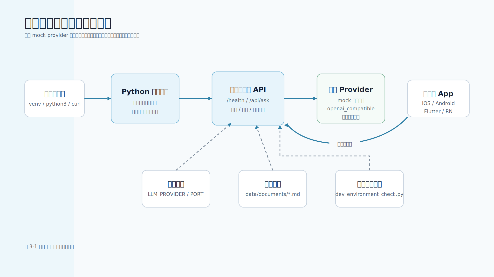

# 第 3 章 Python 服务端环境与移动端接入准备

## 本章导读

第 1 章解释了大模型应用为什么需要自有服务端，第 2 章解释了 Token、上下文窗口、采样和幻觉等基础机制。本章开始把这些认知落到开发环境中：怎样准备一个可以运行、可以测试、不会泄露密钥的 Python 服务端；怎样让移动端只调用自有 API；怎样在没有真实模型密钥的情况下先跑通完整链路；怎样在需要时切换到真实模型网关。

本书配套工程位于 `examples/01-mobile-knowledge-assistant/`。它不是伪代码项目，而是一个可运行的本地服务端示例：默认使用 `mock` provider，不需要 API 密钥；切换 `openai_compatible` provider 后，可以连接兼容聊天补全接口的模型服务。移动端开发者可以先用命令行和 `curl` 理解服务端边界，再把同样的 API 契约接到 iOS、Android、Flutter 或 React Native 项目中。

图 3-1 展示了本章需要建立的本地开发与移动端调试环境。



## 学习目标

- 创建隔离的 Python 服务端虚拟环境。
- 理解 `.env.example`、环境变量和真实密钥之间的边界。
- 使用本章新增的环境检查脚本验证本地工程是否可运行。
- 启动本地服务端，并通过 `curl` 请求 `/health` 和 `/api/ask`。
- 知道 iOS 模拟器、Android 模拟器和真机调试时应该如何访问本地服务。
- 能够区分 mock provider、本地服务端和真实模型网关的职责。

## 核心内容

### 3.1 为什么先搭服务端环境

移动端开发者很容易从客户端视角出发：页面上有一个输入框，点击发送后调用模型接口，把回答显示在聊天气泡里。这个理解少了关键一层。大模型 API 密钥、提示词模板、检索资料、权限判断、成本控制、日志审计和错误兜底都应该在服务端完成。

如果移动端直接调用模型提供方，会有几个明显风险：

| 风险 | 具体表现 | 正确边界 |
| --- | --- | --- |
| 密钥泄露 | App 包可被反编译，抓包也可能暴露请求 | 密钥只放服务端环境变量或密钥管理系统 |
| 权限绕过 | 客户端隐藏按钮不等于服务端拒绝访问 | 服务端按用户、租户、文档权限过滤 |
| 成本失控 | 被刷接口或超长上下文导致账单异常 | 服务端限流、计费、缓存和审计 |
| 模型切换困难 | 客户端写死供应商字段，升级成本高 | 服务端封装 provider，客户端只看自有 API |
| 错误体验不稳定 | 模型错误直接暴露给用户 | 服务端统一错误码和可重试策略 |

因此，本章的目标不是让读者“装好 Python”这么简单，而是建立一个后续章节都能复用的服务端底座。

### 3.2 项目结构

配套工程的核心结构如下：

```text
examples/01-mobile-knowledge-assistant/
  README.md
  requirements.txt
  .env.example
  data/
    documents/
    eval/
    multimodal/
    observability/
    prompt/
    tools/
    workflow/
  scripts/
    dev_environment_check.py
    ...
  src/
    mobile_llm/
      app.py
      config.py
      prompts.py
      providers.py
      retriever.py
      service.py
  tests/
```

几个目录的职责要先分清：

| 路径 | 作用 |
| --- | --- |
| `src/mobile_llm/` | 服务端主代码，包含配置、HTTP 入口、检索、提示词、Provider 和业务服务 |
| `data/documents/` | 可公开的本地知识库示例文档 |
| `scripts/` | 每章配套的可运行脚本，用来观察某个工程机制 |
| `tests/` | 自动化测试，验证服务端、脚本和边界条件 |
| `.env.example` | 可提交的配置模板，只放占位符 |
| `requirements.txt` | 当前仅保留说明性注释，工程默认使用 Python 标准库 |

当前示例故意优先使用 Python 标准库。这样做不是为了鼓励生产系统不用框架，而是为了让读者先看清链路本身：HTTP 请求如何进入服务端，配置如何读取，Provider 如何切换，模型输出如何返回移动端。正式项目可以迁移到 FastAPI、Django、Flask、Ktor、Spring Boot 或团队内部网关。

### 3.3 创建虚拟环境

进入示例工程：

```bash
cd examples/01-mobile-knowledge-assistant
python3 -m venv .venv
source .venv/bin/activate
python3 -m pip install -r requirements.txt
```

`requirements.txt` 目前只有说明性注释，没有第三方依赖。保留这个文件有两个好处：第一，读者可以使用统一的安装命令；第二，后续接入真实 SDK、Web 框架或观测组件时，不需要改变项目入口。

可以检查当前 Python 版本：

```bash
python3 --version
```

配套代码使用了类型标注、`dataclass`、`pathlib`、`http.server`、`urllib` 等标准库能力，建议使用 Python 3.10 或更新版本。不要把虚拟环境目录提交到仓库，根目录 `.gitignore` 已经包含 `.venv/`、`__pycache__/` 和 `.pyc` 文件。

### 3.4 配置与密钥边界

`.env.example` 是可提交的模板：

```text
LLM_PROVIDER=mock
LLM_API_URL=https://api.example.com/v1/chat/completions
LLM_API_KEY=replace-with-your-api-key
LLM_MODEL=example-chat-model
HOST=127.0.0.1
PORT=8000
```

这里有 3 条规则。

第一，`.env.example` 可以提交，因为它只包含占位符。真实 `.env`、本地 shell 配置、密钥管理系统中的真实值不能提交。

第二，示例服务默认读取环境变量，不会自动解析 `.env` 文件。读者可以直接使用 `export` 设置变量，也可以在自己的团队脚手架中接入安全的 `.env` 加载器。

第三，`LLM_API_KEY` 只应被服务端进程读取。移动端只需要知道自有服务端地址，例如 `https://api.example.com/api/ask`，不应该知道模型供应商密钥。

配置读取集中在 `src/mobile_llm/config.py`：

```python
@dataclass(frozen=True)
class Settings:
    host: str
    port: int
    provider: str
    api_url: str
    api_key: str
    model: str
    docs_dir: Path


def load_settings() -> Settings:
    docs_dir = Path(os.getenv("DOCS_DIR", PROJECT_ROOT / "data" / "documents"))
    return Settings(
        host=os.getenv("HOST", "127.0.0.1"),
        port=int(os.getenv("PORT", "8000")),
        provider=os.getenv("LLM_PROVIDER", "mock"),
        api_url=os.getenv("LLM_API_URL", "https://api.example.com/v1/chat/completions"),
        api_key=os.getenv("LLM_API_KEY", ""),
        model=os.getenv("LLM_MODEL", "example-chat-model"),
        docs_dir=docs_dir,
    )
```

集中读取配置可以避免业务代码到处访问环境变量，也便于测试。生产系统还应补充配置校验、密钥管理、分环境配置和审计。

### 3.5 运行环境检查脚本

本章新增 `scripts/dev_environment_check.py`。它会检查 Python 版本、`requirements.txt`、`.env.example`、根目录 `.gitignore`、示例文档目录和本地 mock 知识助手链路。

运行：

```bash
python3 scripts/dev_environment_check.py
```

输出节选如下：

```json
{
  "passed": true,
  "settings": {
    "host": "127.0.0.1",
    "port": 8000,
    "provider": "mock",
    "api_key_set": false
  },
  "checks": [
    {"name": "python_version", "passed": true},
    {"name": "env_example", "passed": true},
    {"name": "gitignore_env_rule", "passed": true},
    {"name": "docs_dir", "passed": true},
    {"name": "mock_assistant_smoke", "passed": true}
  ]
}
```

脚本只报告 `api_key_set`，不会把真实密钥写入输出。它默认使用 `MockLLMProvider`，因此不会花费 Token，也不会调用外部模型服务。若某项检查失败，进程返回非零退出码，适合放入 CI 或公开仓库的本地验收步骤。

如果文档目录不存在，可以用下面的命令观察失败输出：

```bash
python3 scripts/dev_environment_check.py --docs-dir /tmp/missing-docs
```

这类检查能帮助读者先确认“本地工程能跑”，再进入后续章节的 API、RAG、评测和上线优化。

### 3.6 启动本地服务端

启动服务：

```bash
PYTHONPATH=src python3 -m mobile_llm.app
```

终端会输出类似：

```text
Serving on http://127.0.0.1:8000
```

另开一个终端检查健康状态：

```bash
curl -s http://127.0.0.1:8000/health | python3 -m json.tool
```

预期输出：

```json
{
  "status": "ok"
}
```

请求问答接口：

```bash
curl -s http://127.0.0.1:8000/api/ask \
  -H 'Content-Type: application/json' \
  -d '{"question":"移动端为什么不能直接保存模型 API 密钥？","request_id":"req_debug_001"}' | python3 -m json.tool
```

返回中应包含 `answer` 和 `citations`。如果请求体中带了 `request_id`，服务端也会把它原样返回，方便移动端把一次请求串联到客户端日志、服务端日志和用户反馈：

```json
{
  "answer": "移动端 App 不应该直接保存模型 API Key...",
  "citations": [
    {
      "source": "mobile_ai_api.md",
      "title": "移动端 AI 接入指南",
      "section": "API Key 管理",
      "score": 0.3712
    }
  ],
  "request_id": "req_debug_001"
}
```

这说明 4 个环节已经跑通：

1. HTTP 请求进入 `mobile_llm.app`。
2. `KnowledgeAssistant` 调用本地检索器。
3. `MockLLMProvider` 生成稳定答案。
4. 服务端把答案和引用来源返回给客户端。

如果端口被占用，可以换一个端口：

```bash
PORT=8010 PYTHONPATH=src python3 -m mobile_llm.app
```

### 3.7 移动端调试地址

本地调试时，移动端如何访问服务端取决于运行环境：

| 调试环境 | 访问方式 | 说明 |
| --- | --- | --- |
| iOS Simulator | `http://127.0.0.1:8000` | 模拟器通常可以访问 Mac 本机回环地址 |
| Android Emulator | `http://10.0.2.2:8000` | Android 模拟器使用 `10.0.2.2` 指向宿主机 |
| Flutter / RN 桌面调试 | 按运行平台决定 | iOS 模拟器和 Android 模拟器规则不同 |
| 真机同一局域网 | `http://<Mac 局域网 IP>:8000` | 服务端需绑定 `HOST=0.0.0.0`，只在可信网络使用 |

真机调试示例：

```bash
HOST=0.0.0.0 PORT=8000 PYTHONPATH=src python3 -m mobile_llm.app
```

然后在移动端请求：

```text
http://你的-Mac-局域网-IP:8000/api/ask
```

不要把本地开发服务直接暴露到公网。示例服务没有生产级认证、TLS、限流和审计，只适合本机或可信局域网调试。在 iOS 或 Android App 中访问本地 HTTP 服务时，ATS 或 cleartext HTTP 例外只应该放在 Debug 配置；生产环境必须使用 HTTPS。

移动端请求体可以保持很简单：

```json
{
  "question": "如何处理移动端流式输出？",
  "request_id": "req_debug_001"
}
```

`request_id` 不是必须字段，但强烈建议真实项目保留。它可以串联移动端日志、服务端日志、模型调用日志和问题反馈。

### 3.8 切换真实模型服务

默认配置是：

```bash
export LLM_PROVIDER=mock
```

切换真实模型服务时，使用兼容聊天补全接口的 provider：

```bash
export LLM_PROVIDER=openai_compatible
export LLM_API_URL=https://api.example.com/v1/chat/completions
export LLM_MODEL=example-chat-model
export LLM_API_KEY=replace-with-your-real-key
PYTHONPATH=src python3 -m mobile_llm.app
```

上面的 `replace-with-your-real-key` 只能替换为你本地安全保存的真实值，不要写入仓库、截图、日志或提交记录。生产环境应优先使用云平台密钥管理、容器运行时注入或企业配置中心，而不是把真实密钥写在代码中。

真实 provider 的最小实现位于 `src/mobile_llm/providers.py`。它使用标准库 `urllib` 发起请求，并处理常见可重试错误：

```python
RETRYABLE_HTTP_STATUS = {408, 429, 500, 502, 503, 504}

class OpenAICompatibleProvider:
    def __init__(self, settings: Settings):
        if not settings.api_key:
            raise ValueError("LLM_API_KEY is required when LLM_PROVIDER=openai_compatible")
        self.settings = settings
```

生产项目通常还需要补充：

- 请求超时、连接池和并发控制。
- 结构化日志和链路追踪。
- Token 用量统计和成本报表。
- 错误码映射和降级策略。
- 流式响应的真实上游解析。
- 企业模型网关的鉴权和审计。

这些内容会在第 5 章、第 13 章和第 14 章继续展开。本章只要求读者知道如何从 mock 切换到真实 provider，并理解密钥仍然留在服务端。

### 3.9 常见问题

| 问题 | 可能原因 | 处理方式 |
| --- | --- | --- |
| `ModuleNotFoundError: mobile_llm` | 没有设置 `PYTHONPATH=src` | 在命令前加 `PYTHONPATH=src`，或安装为本地包 |
| `address already in use` | 端口 8000 被占用 | 改用 `PORT=8010` |
| `question is required` | 请求体缺少 `question` | 检查 JSON 请求体 |
| Android 模拟器访问失败 | 地址写成了 `127.0.0.1` | 改用 `10.0.2.2` |
| 真机访问失败 | 服务绑定在 `127.0.0.1` 或防火墙阻止 | 使用 `HOST=0.0.0.0` 并确认同一局域网 |
| 真实模型返回 401 | API Key 或模型网关鉴权错误 | 检查服务端环境变量，不要在移动端配置密钥 |
| 回答没有引用来源 | 文档目录为空或检索未命中 | 运行 `scripts/dev_environment_check.py` 和 `scripts/rag_trace.py` |

## 本章小结

本章完成了后续实践的服务端环境准备。读者应该能够创建虚拟环境、理解 `.env.example` 与真实密钥的边界、运行环境检查脚本、启动本地服务端，并通过 `curl` 访问 `/health` 和 `/api/ask`。

更重要的是，读者应该建立一个工程判断：移动端大模型能力不是客户端直连模型，而是移动端调用自有服务端，自有服务端负责配置、密钥、检索、提示词、模型 provider、错误兜底和审计。只有这条链路清楚，后续的流式输出、结构化工具调用、RAG、Agent、评测和上线优化才有稳定基础。

## 实践练习

1. 运行 `python3 scripts/dev_environment_check.py`，确认每个检查项的含义。
2. 启动本地服务后，用 `curl` 请求 `/health` 和 `/api/ask`，观察返回结构。
3. 修改 `PORT=8010` 重新启动服务，确认请求地址也要同步修改。
4. 在 Android Emulator 中把服务端地址从 `127.0.0.1` 改为 `10.0.2.2`，解释原因。
5. 把 `LLM_PROVIDER` 切换为 `openai_compatible`，但不设置 `LLM_API_KEY`，观察服务端启动或请求失败方式，并说明为什么密钥不能放在移动端。
