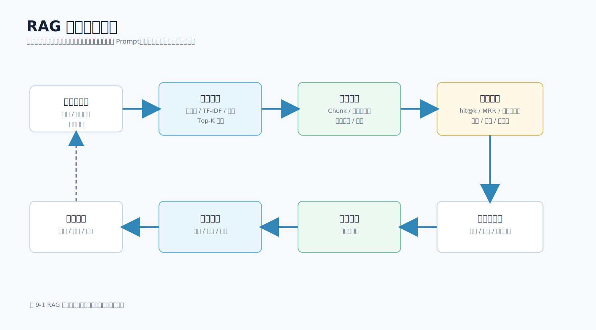

# 第 9 章 RAG 工程优化

## 本章导读

一个能跑通的 RAG 应用，不等于一个可靠的 RAG 应用。第 8 章已经完成了从文档检索到提示词（Prompt）构造再到引用来源返回的主流程。本章关注下一步：当用户说“答得不准”“引用不对”“找不到文档”“回答太慢”时，工程师应该从哪里开始排查，如何证明优化真的有效。

RAG 优化最容易犯的错误，是把所有问题都归因到提示词（Prompt）。Prompt 当然重要，但很多质量问题发生在更早的位置：文档过期、切分错误、权限过滤不完整、关键词没有命中、向量召回偏离、Top-K 太大、重排缺失、引用没有校验。只有先把检索链路看清楚，再调整生成环节，系统质量才会稳定提升。

图 9-1 展示了 RAG 工程优化的闭环。



本章配套新增 `scripts/rag_eval.py` 和 `data/eval/rag_eval_cases.json`，用于检查当前检索器是否能召回期望文档章节。这个脚本不调用模型，不需要 API 密钥（API Key），重点衡量“资料有没有给对”。在真实项目中，这类检索评测应成为 RAG 改动的回归门禁。

## 学习目标

- 识别 RAG 质量差的常见原因，并区分召回问题、排序问题和生成问题。
- 理解文档片段（Chunk）策略、元数据过滤、混合检索和重排各自解决什么问题。
- 能够用黄金问题集评估检索质量，读懂 hit@k 和 MRR。
- 知道移动端页面反馈如何反哺 RAG 优化。
- 掌握 RAG 上线前的最小回归检查方法。

## 核心内容

### 9.1 先做问题归因

RAG 失败通常有多种表现：

| 现象 | 更可能的问题 | 首先检查 |
| --- | --- | --- |
| 答案完全跑偏 | 正确资料没有召回 | Top-K 检索结果 |
| 答案泛泛而谈 | 召回片段过长或无关 | Chunk 内容和分数 |
| 答案正确但引用错误 | 引用校验缺失 | `citations` 与 Prompt 片段 |
| 引用正确但总结错误 | 生成环节误解资料 | Prompt 和模型输出 |
| 不同用户看到不该看的资料 | 权限过滤问题 | metadata filter 和 ACL |
| 延迟高 | 检索、重排或模型调用过慢 | 分段耗时日志 |

排查顺序应是：

1. 看用户问题。
2. 看召回了哪些片段。
3. 看这些片段是否有权限、是否过期、是否与问题相关。
4. 看 Prompt 是否清楚区分资料和指令。
5. 看模型是否根据资料回答。
6. 看移动端是否正确展示答案、引用和错误状态。

这就是“先看召回，再看生成”。如果正确资料没有进入上下文，模型无法凭空给出可靠答案；如果资料已经给对，再去调 Prompt 和模型参数才有意义。

### 9.2 Chunk 策略：切得太碎和太粗都会出问题

Chunk 是 RAG 的基本单位。切分策略决定了检索器召回什么内容，也决定了模型看到多少上下文。

常见切分策略如下：

| 策略 | 优点 | 风险 | 适合资料 |
| --- | --- | --- | --- |
| 固定长度 | 实现简单，长度可控 | 容易打断语义 | 长篇连续文本 |
| 按标题切分 | 保留结构，引用清晰 | 标题层级混乱时效果差 | 技术文档、规范 |
| 按段落切分 | 片段自然，易展示 | 段落过短时上下文不足 | FAQ、说明文档 |
| 滑动窗口 | 保留相邻上下文 | 重复内容增加成本 | 长日志、长报告 |
| 语义切分 | 更贴近主题边界 | 实现和评测成本高 | 内容结构不稳定的资料 |

移动端知识助手通常从“按标题 + 段落”开始。原因是技术文档、隐私规范、接口说明大多有标题结构；引用卡片也可以直接展示“文档标题 + 章节标题 + 原文片段”。

切分时要保留元数据：

- `doc_id`：稳定文档 ID。
- `chunk_id`：稳定片段 ID。
- `source`：来源文件或 URL。
- `title`：文档标题。
- `section`：章节标题。
- `updated_at`：更新时间。
- `visibility`：权限范围。
- `owner_team`：维护团队。

没有元数据的 Chunk 很难生产化。它既无法做权限过滤，也无法展示引用来源，更无法定位哪段资料过期。

### 9.3 Top-K 不是越大越好

很多人遇到 RAG 回答不准，第一反应是把 Top-K 调大。Top-K 调大确实可能提高召回概率，但也会带来副作用：

- 更多无关片段进入 Prompt。
- Token 成本上升。
- 模型更容易混淆多个来源。
- 引用列表变长，移动端展示负担增加。
- 流式回答首 Token 延迟可能变高。

移动端知识问答可以从 Top-3 到 Top-5 开始。内部研发助手、日志分析这类需要更多上下文的场景，可以尝试 Top-8 或 Top-10，但必须用评测集衡量效果，而不是凭感觉。

一个实用规则是：如果正确片段在 Top-20 中出现但不在 Top-3 中，说明召回可以但排序需要优化；如果 Top-20 都没有正确片段，说明切分、索引、查询改写或检索模型本身有问题。

### 9.4 元数据过滤：先过滤权限，再谈召回

RAG 检索不是从所有文档中找最相似片段，而是从“当前用户有权访问的文档”中找最相似片段。对于移动端 App，至少要考虑：

| 元数据 | 用途 |
| --- | --- |
| `tenant_id` | 租户隔离 |
| `user_role` | 角色权限 |
| `visibility` | 公开、内部、团队、个人 |
| `platform` | iOS、Android、Flutter、React Native |
| `version` | App 版本或文档版本 |
| `updated_at` | 过滤过期资料 |
| `locale` | 语言和地区 |

权限过滤应尽量在检索条件中完成。如果向量库或检索引擎暂时不支持前置过滤，就必须过量召回，再由服务端二次过滤，并补足候选数量。无论采用哪种方式，无权资料都不能进入 Prompt，也不能出现在移动端引用卡片里。

元数据过滤也能提升质量。例如用户在 Android 页面提问“权限弹窗什么时候展示”，检索时可以优先过滤 `platform=android` 的资料；如果没有命中，再退回通用隐私规范。这样比把所有平台文档混在一起更稳定。

### 9.5 混合检索：关键词和向量互补

向量检索擅长语义相似，关键词检索擅长精确匹配。移动端场景中有大量精确符号：

- 错误码，如 `E1024`。
- 接口名，如 `/api/ask/stream`。
- 类名和方法名。
- App 版本号。
- 设备型号。
- 订单号、工单号。
- 权限名和系统 API。

这些内容不一定适合只靠向量检索。一个常见混合检索流程是：

1. 关键词检索召回 Top-20。
2. 向量检索召回 Top-20。
3. 按 `doc_id + chunk_id` 去重。
4. 根据关键词命中、向量分数、文档新鲜度、权限优先级合并打分。
5. 选择 Top-5 进入重排或 Prompt。

对于书中的配套工程，`LocalRetriever` 是一个本地关键词/字符重叠检索器，`tfidf_vector_search.py` 是一个本地 TF-IDF 向量实验。它们都不是生产向量库，但可以帮助读者理解：检索优化不是单一路线，而是多个信号的组合。

### 9.6 重排：把“召回多”变成“给得准”

初步召回通常追求“不要漏”，重排追求“给模型看的片段要准”。典型流程是：

```text
召回 Top-20 -> 重排 Top-5 -> 构造 Prompt -> 生成答案
```

重排可以使用规则，也可以使用模型。

规则重排适合早期项目：

- 标题或章节命中加分。
- 文档更新时间越新越靠前。
- 同平台文档加分。
- 权限范围更具体的文档加分。
- 用户反馈为“引用错误”的片段降权。

模型重排适合资料规模变大后使用。它会把“问题 + 候选片段”作为输入，输出相关性分数。代价是延迟和成本增加。因此移动端场景需要关注首屏体验：如果重排耗时过高，可以采用“先返回加载态或短答案，再补充引用”的产品设计，但服务端仍要保证引用来源和最终答案一致。

### 9.7 一个引用错误的排查案例

假设移动端用户问：“相册和麦克风权限应该什么时候申请？”系统回答中提到了“用户进入 AI 图片识别页面时可以申请相册权限”，但引用卡片却显示为《移动端 AI 接入指南 / API Key 管理》。这类问题看起来像模型胡说，实际可能发生在多个环节。

第一步，先看检索结果。如果 Top-3 中根本没有《移动端隐私与权限审查 / 相册与麦克风权限》，问题出在召回。工程师应检查文档是否被导入、标题是否被正确切分、查询中“相册”“麦克风”“权限”这些词是否被保留，以及检索器是否把平台无关文档排在了前面。

第二步，如果正确片段出现在 Top-3，但排在后面，而错误引用排在第一位，问题更可能出在排序或重排。此时不必马上修改 Prompt，可以先尝试标题命中加权、章节命中加权、同平台标签加权，或者把 Top-20 候选交给重排器重新排序。

第三步，如果正确片段已经排在第一位，但返回给移动端的引用仍然错误，就要检查服务层的引用组装逻辑。常见错误包括：答案使用了一个上下文列表，引用却从另一个列表取；排序后没有同步更新 `citations`；模型输出引用编号后，服务端没有校验编号是否来自本次检索结果。

第四步，如果检索和引用都正确，但模型把权限申请时机总结错了，才进入 Prompt 和生成层排查。可以检查系统指令是否要求“资料不足时明确说明”，是否把多篇资料混在一起导致边界不清，以及是否需要让模型按“结论、依据、限制条件”三段输出。

这个案例说明，RAG 问题不要用一个“回答不准”概括。一次线上反馈至少要还原出：用户问题、检索 Top-K、重排 Top-K、Prompt 摘要、模型版本、引用列表、移动端展示状态和反馈类型。缺少这些字段，团队只能靠猜。

移动端埋点可以从以下字段开始：

| 字段 | 示例 | 用途 |
| --- | --- | --- |
| `request_id` | `req_20260621_001` | 串联问题、回答、引用和反馈 |
| `question_hash` | 脱敏后的问题摘要 | 避免直接记录原始隐私文本 |
| `retrieved_chunks` | `doc_id/chunk_id/rank/score` | 复盘召回和排序 |
| `prompt_version` | `rag_v3` | 判断问题是否由 Prompt 改动引入 |
| `model_version` | `example-chat-model` | 对比不同模型输出 |
| `ui_state` | `done`、`cancelled`、`failed` | 区分模型问题和客户端状态问题 |
| `feedback_type` | `citation_wrong` | 进入人工复核和评测集沉淀 |

这些日志需要脱敏和权限控制，不能把原始用户问题、内部文档全文和敏感业务数据直接写入普通日志。第 15 章会继续讨论安全与隐私边界。

## 动手实践

### 9.8 用黄金问题集评估检索

没有评测集，就无法判断优化是否真的有效。RAG 评测可以从小开始，不必一开始搭建复杂平台。最小评测集包含 4 个字段：

| 字段 | 含义 |
| --- | --- |
| `id` | 用于定位用例 |
| `question` | 用户可能提出的问题 |
| `expected_source` | 应召回的文档 |
| `expected_section` | 应召回的章节 |

配套工程的 `data/eval/rag_eval_cases.json` 就是这样的黄金问题集。它包含 API 密钥（API Key）、流式输出、权限申请、数据最小化、崩溃日志脱敏、上传堆栈前的个人字段处理和崩溃输出结构等问题。

运行评测：

```bash
cd examples/mobile-knowledge-assistant
python3 scripts/rag_eval.py --top-k 3
```

典型输出包含：

```json
{
  "top_k": 3,
  "case_count": 7,
  "hit_count": 7,
  "hit_rate": 1.0,
  "mrr": 0.9048,
  "results": [
    {
      "id": "api_key_boundary",
      "hit": true,
      "rank": 1
    }
  ]
}
```

这里有两个指标：

- `hit_rate`：本脚本对 hit@k 的汇总，表示有多少比例的用例在 Top-K 中命中期望章节。
- `mrr`：Mean Reciprocal Rank，平均倒数排名。正确片段越靠前，MRR 越高。

如果 hit@3 很高但 MRR 低，说明正确片段能召回，但排序不够好。如果 hit@10 仍然低，说明资料切分、查询表达、索引或检索策略存在更深问题。

黄金问题集不要只由工程师拍脑袋编写。更可靠的来源包括：

- 移动端搜索框和客服入口中的真实高频问题，先脱敏再入库。
- 线上“无用”“引用错误”“资料过期”反馈。
- 新版本上线前产品、测试和法务最关心的问题。
- 事故复盘中出现过的错误问法。
- 每个核心文档维护者提供的 3～5 个必答问题。

移动端问题样本还应尽量保留脱敏后的工程上下文。例如 App 版本、系统版本、平台、功能入口、页面路由、SDK 版本、网络状态和用户所在地区。这些字段不一定都参与检索，但能帮助团队判断问题是否只出现在某个 Android 版本、某条 iOS 页面链路、某个 Flutter 容器或某个 React Native 模块里。

评测集也要版本化。一次文档重构后，旧的 `expected_section` 可能已经不存在；这时应该明确更新评测用例，而不是删除失败用例来获得漂亮分数。删除用例要写明原因，例如“文档废弃”“业务流程下线”或“合并到新章节”。否则 RAG 评测会慢慢变成形式主义。

### 9.9 评测脚本的工程边界

`rag_eval.py` 只评估检索，不评估模型回答。这是刻意设计的。RAG 优化需要分层评估：

| 层次 | 评估问题 | 示例指标 |
| --- | --- | --- |
| 检索 | 正确资料是否被召回 | hit@k、MRR |
| Prompt | 资料是否被清晰放入上下文 | Prompt 检查、上下文长度 |
| 生成 | 答案是否覆盖要点 | 人工评分、自动评分 |
| 引用 | 引用是否来自本次检索 | 引用 ID 校验 |
| 移动端体验 | 用户是否能理解和反馈 | 首 Token 延迟、反馈率 |

不要用一个总分掩盖问题来源。比如答案质量低，可能是正确资料没有召回，也可能是召回了但 Prompt 太乱，还可能是模型总结错误。分层评估才能指导下一步优化。

评测脚本也不能只在开发者机器上跑。正式项目应把它接入 CI 或发布前检查。修改切分、检索、重排或知识库导入逻辑后，应重新运行检索评测；修改 Prompt 后，还应结合 Trace、回答评测或人工复核验证答案质量。

### 9.10 移动端反馈如何反哺 RAG

移动端页面是最接近真实用户的反馈入口。RAG 系统至少应收集 4 类反馈：

| 反馈类型 | 需要记录 |
| --- | --- |
| 有用 / 无用 | `request_id`、问题类型、答案状态 |
| 引用错误 | `chunk_id`、文档标题、章节 |
| 资料过期 | `doc_id`、`updated_at`、用户备注 |
| 没有找到答案 | 问题、检索结果数量、功能入口 |

反馈不能只存文本。它必须和检索片段、模型版本、Prompt 版本、文档版本关联起来。否则团队只能看到“用户说不好用”，却无法判断是资料缺失、召回失败、重排不准还是模型生成问题。

移动端 UI 上，反馈入口不需要复杂。答案下方的“有用”“无用”“引用错误”就能积累第一批数据。内部工具可以再增加“期望引用文档”“补充资料链接”等字段。

不要把所有反馈都直接写成评测用例。用户的“无用”可能来自答案太长、页面加载太慢、引用折叠太深，也可能来自用户原本就问了超出资料范围的问题。比较稳妥的流程是：

1. 收集反馈和请求链路信息。
2. 人工复核问题是否合理、资料是否存在、引用是否错误。
3. 将确认为召回或排序问题的样本加入检索评测集。
4. 将确认为生成质量问题的样本加入回答评测集。
5. 将确认为产品体验问题的样本交给移动端页面或交互流程优化。

这样才能让反馈真正反哺 RAG，而不是把所有问题都堆进一个模糊的“AI 不好用”列表。

### 9.11 上线前 RAG 优化检查清单

上线前至少检查：

| 类别 | 检查项 |
| --- | --- |
| 文档 | 是否去重、去噪、标注更新时间 |
| Chunk | 是否保留标题、章节、来源、权限元数据 |
| 权限 | 无权资料是否无法进入 Prompt 和 citations |
| 检索 | 核心问题集 hit@k 是否达标 |
| 排序 | 正确片段是否尽量靠前 |
| 重排 | 是否评估延迟和收益 |
| Prompt | 是否明确资料边界和引用要求 |
| 移动端 | 是否展示引用、加载态、错误态和反馈入口 |
| 回归 | 修改检索后是否运行检索评测；修改 Prompt 后是否运行 Trace、回答评测或人工复核 |

这张清单应和第 15 章的安全清单一起使用。RAG 优化不是只追求“更聪明”，还要保证授权、可追溯和可回滚。

## 本章小结

RAG 优化的核心顺序是：先定位问题，再选择策略，最后用评测证明改动有效。Chunk、元数据过滤、混合检索、重排、Prompt 和移动端反馈都很重要，但它们解决的问题不同。不要用调 Prompt 代替检索优化，也不要用主观感觉代替评测指标。

完成本章后，读者应该能够运行 `scripts/rag_eval.py`，解释 hit@k 和 MRR 的含义，并说清楚一次 RAG 质量问题究竟发生在召回、排序、生成、引用还是移动端展示层。

## 实践练习

1. 为 `data/documents/` 增加 3 条新的评测问题，分别覆盖 API Key、隐私权限和崩溃分析。
2. 把 `--top-k` 从 1 调到 5，观察 hit_rate 和 MRR 的变化。
3. 修改某篇文档标题或章节标题，重新运行 `scripts/rag_eval.py`，观察评测是否暴露召回变化。
4. 设计一个混合检索打分公式，说明关键词命中、向量分数、更新时间和平台标签各占多少权重。
5. 为移动端引用卡片增加“引用错误”反馈字段，并说明服务端如何把反馈写回评测集。
