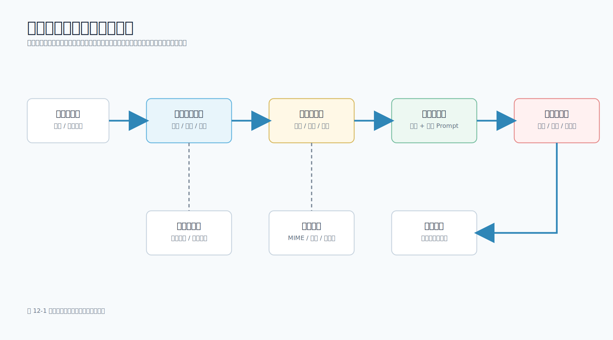

# 第 12 章 多模态大模型应用

## 本章导读

前面几章主要讨论文本：Prompt、结构化输出、RAG、Agent 和 Workflow。真实移动端应用里，用户输入不只是一段文字。用户可能上传截图、拍照、录音、扫描 PDF，也可能希望模型理解一个界面、一个报错弹窗或一张票据。

多模态模型让这些输入进入大模型系统，但它并不意味着“把文件直接丢给模型”。移动端负责采集和交互，服务端负责文件校验、脱敏、存储和模型调用，业务系统负责确认和落库。任何一个环节偷懒，都会带来隐私、成本、延迟或误操作风险。

图 12-1 展示了一个移动端截图分析功能的工程链路。



本章配套新增 `scripts/image_ticket_payload.py` 和 `data/multimodal/login_error.svg`。脚本会检查截图文件类型、大小和尺寸，计算摘要，生成一个可交给多模态模型网关的请求 payload，并给出结构化输出 schema。它默认不调用外部模型服务，读者可以在没有 API Key 的情况下运行完整流程。

## 学习目标

- 理解多模态能力不是单一能力，而是多类输入理解与结构化输出约束的组合。
- 掌握移动端采集图片、录音和文档时的权限、隐私和体验边界。
- 能够设计截图分析、语音输入和文档解析的服务端流程。
- 能够运行配套脚本，生成多模态模型请求 payload 和结构化输出 schema。
- 知道哪些工作应该交给模型，哪些工作必须由确定性代码完成。

## 核心内容

### 12.1 多模态能力解决什么问题

多模态模型可以把图片、音频、视频或文档作为输入，也可以输出文本、结构化 JSON、图片或语音。本书面向移动端开发工程师，重点不是训练多模态模型，而是如何把多模态能力放进一个可靠的移动端产品链路。

常见能力可以分成 4 类：

| 类型 | 输入 | 输出 | 移动端场景 |
| --- | --- | --- | --- |
| 图片理解 | 截图、照片、图表、票据 | 描述、分类、结构化字段 | 截图报错分析、票据识别、UI 走查 |
| OCR 与文档理解 | 图片、PDF、扫描件 | 文本、表格、章节结构 | 合同摘要、表单录入、知识库导入 |
| 语音理解 | 录音、语音消息 | 转写文本、摘要、待办 | 语音搜索、会议纪要、客服回访 |
| 图文生成 | 文本、参考图 | 图片、海报、示意图 | 运营素材、封面草图、商品图优化 |

这些能力的共同点是：模型能处理更丰富的输入，但系统仍要给它明确的任务和边界。比如“看一下这张截图”太宽泛；“提取可见错误、影响页面、可能原因和下一步排查动作，并返回 JSON”才适合进入工程系统。

### 12.2 移动端采集：先考虑权限和体验

多模态输入通常从移动端开始。截图分析可能来自相册或系统分享；拍照问答需要相机权限；语音输入需要麦克风权限；文档解析可能来自文件选择器或云盘。

移动端侧要处理 5 件事：

1. 权限说明：向用户解释为什么需要相册、相机、麦克风或文件访问权限。
2. 文件预览：上传前让用户确认文件内容，避免误传隐私截图。
3. 本地压缩：图片过大时先压缩尺寸和质量，减少上传耗时和模型成本。
4. 取消上传：弱网下允许用户取消，服务端也要能丢弃未完成任务。
5. 状态展示：区分“上传中”“分析中”“等待确认”“创建工单成功”等状态。

移动端不应该直接调用模型提供方，也不应该持有模型 API Key。即使模型接口支持图片上传，也应由自有服务端接收文件并完成校验。原因很简单：文件安全、权限判断、成本控制和审计日志都需要放在服务端。

### 12.3 服务端预处理：不要把脏文件交给模型

服务端拿到文件后，第一步不是调用模型，而是预处理。至少要检查：

| 检查项 | 目的 |
| --- | --- |
| 文件类型 | 拒绝脚本、压缩包、伪装扩展名 |
| 文件大小 | 控制上传成本和模型成本 |
| 图片尺寸 | 防止超大图片拖垮内存或模型上下文 |
| 元数据 | 去除 EXIF、地理位置、设备信息 |
| 可见隐私 | 对手机号、邮箱、Token、身份证号做遮挡或提醒 |
| 存储策略 | 使用临时存储和过期清理，不长期保存原始文件 |

需要注意：当前配套脚本只做文件类型、大小、尺寸和摘要校验，不实现截图内容级隐私识别或遮挡。生产系统如果要处理真实截图，还需要增加 OCR/规则识别、用户确认或人工复核，不能把“已检查文件格式”等同于“已完成隐私脱敏”。

配套脚本里的 `inspect_image()` 就承担这个角色。它只使用 Python 标准库，支持 PNG、JPEG、GIF 和 SVG 的基本尺寸解析：

```python
def inspect_image(path: Path, max_bytes: int = DEFAULT_MAX_BYTES, max_side: int = DEFAULT_MAX_SIDE) -> ImageInfo:
    """Validate a local screenshot and extract metadata without third-party libraries."""

    image_path = Path(path)
    if not image_path.is_file():
        raise FileNotFoundError(f"image not found: {image_path}")

    data = image_path.read_bytes()
    if not data:
        raise ValueError("image file must not be empty")
    if len(data) > max_bytes:
        raise ValueError(f"image is too large: {len(data)} bytes, max {max_bytes} bytes")
```

这段代码体现了一个工程原则：文件是否合法，应该由确定性代码判断，而不是让模型猜。模型可以分析截图内容，但不应该负责判断文件大小是否超限、扩展名是否可信、是否需要脱敏。

配套工程中的 `login_error.svg` 是为了方便版本管理的示例截图。真实移动端截图通常应使用 PNG 或 JPEG；如果使用 JPEG，生产系统还应剥离 EXIF 元数据。不受信任的 SVG 不应直接进入生产多模态网关，必要时应先在服务端重编码为 PNG，并限制脚本执行、外链资源和嵌入内容。

### 12.4 截图分析的任务设计

截图分析不是 OCR 的简单包装。一个好的截图分析任务应该同时给模型 3 类信息：

- 图片本身：用户上传的截图或压缩后的图片。
- 用户补充说明：例如“点击重试无效”“只在弱网出现”。
- 输出约束：必须返回哪些字段，哪些字段不能凭空猜测。

配套脚本生成的请求中，系统消息会限定模型角色：

```python
{
    "role": "system",
    "content": (
        "You analyze mobile app screenshots for engineering triage. "
        "Return JSON only and do not infer private user identity."
    ),
}
```

用户消息里同时包含文本任务和图片：

```python
{
    "role": "user",
    "content": [
        {
            "type": "text",
            "text": (
                "请分析这张移动端截图，提取可见错误、影响页面、可能原因和下一步排查动作。"
                f"用户补充说明：{user_note.strip() or '无'}"
            )
        },
        {"type": "image_url", "image_url": {"url": image_url}},
    ],
}
```

这里的 `image_url` 可以是短期有效、带访问控制的签名 URL，也可以是由模型网关受控读取的内部文件引用；学习脚本为了方便演示，也支持 `data:image/png;base64,...` 形式的数据 URI。生产系统通常更推荐受控 URL 或内部文件引用，因为大型图片直接放入 JSON 会增加请求体大小，不利于日志、网关和重试控制。学习阶段使用数据 URI 更直观，读者能看到模型请求是如何被组织起来的。

### 12.5 结构化输出：让结果进入业务系统

如果模型只返回一段自然语言，后续系统很难自动创建工单、统计问题类型或触发工作流。因此截图分析结果应尽量结构化。

配套脚本使用结构化输出 schema。以下是核心字段节选，完整实现见 `expected_output_schema()`：

```python
{
    "type": "object",
    "required": [
        "summary",
        "visible_error",
        "affected_screen",
        "severity",
        "possible_causes",
        "next_steps",
        "needs_human_review",
        "redaction_notes",
    ],
    "properties": {
        "summary": {"type": "string"},
        "visible_error": {"type": "string"},
        "affected_screen": {"type": "string"},
        "severity": {"type": "string", "enum": ["low", "medium", "high"]},
        "possible_causes": {"type": "array", "items": {"type": "string"}},
        "next_steps": {"type": "array", "items": {"type": "string"}},
        "needs_human_review": {"type": "boolean"},
        "redaction_notes": {"type": "array", "items": {"type": "string"}},
    },
    "additionalProperties": False,
}
```

每个字段都有明确用途：

| 字段 | 用途 |
| --- | --- |
| `summary` | 给客服或研发看的简短摘要 |
| `visible_error` | 截图中可见的错误文本或状态 |
| `affected_screen` | 受影响页面，如登录页、支付页、设置页 |
| `severity` | 初步严重级别，通常只作为建议 |
| `possible_causes` | 可能原因，不能替代日志排查 |
| `next_steps` | 建议的排查动作 |
| `needs_human_review` | 是否必须人工复核 |
| `redaction_notes` | 发现了哪些需要遮挡或避免外发的信息 |

注意，`severity` 不是模型的最终判决。模型可以根据截图给出初步判断，但真正的故障等级还要结合崩溃率、影响用户数、支付损失和监控数据。

### 12.6 运行截图工单 payload 生成器

进入配套工程：

```bash
cd examples/01-mobile-knowledge-assistant
```

运行默认示例：

```bash
python3 scripts/image_ticket_payload.py --omit-image-data
```

`--omit-image-data` 会省略完整 base64 图片内容，便于在终端阅读输出。典型输出包含图片元数据：

```json
{
  "image": {
    "file_name": "login_error.svg",
    "mime_type": "image/svg+xml",
    "width": 390,
    "height": 844,
    "warnings": ["svg_fixture; use PNG or JPEG for real device screenshots"]
  }
}
```

如果要查看完整教学 payload 结构，可以去掉 `--omit-image-data`：

```bash
python3 scripts/image_ticket_payload.py
```

这样会把图片 data URI 打印到终端，真实截图可能因此进入终端历史、日志或录屏。请只对示例图片或已经脱敏的本地图片这样做。

真实项目中，移动端上传的截图路径应由服务端生成，不应让客户端直接决定模型请求。可以像下面这样传入一张本机已有 PNG 或 JPEG：

```bash
python3 scripts/image_ticket_payload.py \
  --image /path/to/your-screenshot.png \
  --note '用户反馈登录页点击重试无效' \
  --ticket-id ticket_2026_001 \
  --omit-image-data
```

其中 `/path/to/your-screenshot.png` 需要替换为本机实际存在的截图路径。生产上传白名单应优先限制为 PNG/JPEG，并在服务端剥离 EXIF、压缩尺寸、必要时重编码后再调用模型网关。

如果文件格式不支持、图片过大或尺寸超限，脚本会在调用模型前失败。这类失败应返回给移动端，让用户重新选择文件或压缩后再上传。

### 12.7 什么时候用模型，什么时候用代码

多模态应用中，容易把所有工作都推给模型。工程上更稳妥的划分是：

| 工作 | 更适合代码 | 更适合模型 |
| --- | --- | --- |
| 文件类型检查 | 是 | 否 |
| 文件大小和尺寸限制 | 是 | 否 |
| EXIF 清理 | 是 | 否 |
| 截图中错误文本理解 | 部分 OCR 可做 | 是 |
| 判断页面大致问题 | 否 | 是 |
| 创建工单 | 服务端执行 | 模型只能给草稿 |
| 影响等级确认 | 结合监控和人工 | 只能建议 |

模型擅长从图像中归纳信息，代码擅长执行规则。截图分析功能要想可靠，必须让两者配合：代码先把输入整理干净，模型再做理解，最后由工作流和人工确认控制副作用。

### 12.8 音频、视频和文档的处理差异

图片只是多模态的一类。音频、视频和文档的工程处理会更复杂。

语音输入通常要先转写成文本。移动端要处理录音权限、静音检测、上传进度和后台中断；服务端要处理音频格式、时长限制、说话人分离和敏感词过滤。转写结果进入后续 RAG 或 Workflow 前，应保留时间戳，方便用户回听原始片段。

视频理解成本更高。不要默认把整段视频交给模型。常见做法是先抽取关键帧、字幕和音频摘要，再把这些中间结果交给模型分析。移动端如果只需要“这段操作哪里失败了”，通常可以上传最近 10 到 20 秒的屏幕录制，而不是完整视频。

文档解析关注结构。PDF 和扫描件可能包含页眉页脚、表格、多栏排版和脚注。进入 RAG 前，应保留页码、标题、段落、表格坐标或来源片段。否则模型即使生成了正确摘要，读者也很难追溯原文依据。

### 12.9 移动端隐私与合规边界

多模态输入比纯文本更容易包含隐私。截图里可能有头像、手机号、聊天内容、地址、订单号、Token；照片可能包含地理位置和设备信息；录音可能包含第三方声音；文档可能包含合同和财务信息。

因此，多模态功能上线前应至少明确：

- 是否默认上传原图，还是默认压缩和脱敏后上传。
- 原始文件保留多久，谁能访问，是否可以删除。
- 是否允许模型供应商保存请求内容用于训练。
- 审计日志是否记录了文件摘要、请求人、时间和用途。
- 用户是否能在上传前预览并取消。
- 高风险输出是否需要人工确认。

在移动端页面上，不要只放一个“上传并分析”按钮。更好的做法是展示文件名、大小、缩略图、隐私提示和取消按钮。用户提交后，服务端也要重新检查权限和参数，不能相信客户端已经做过校验。

## 本章小结

多模态模型扩展了大模型应用的输入范围，但工程边界没有因此消失。移动端负责采集和体验，服务端负责文件安全、脱敏、模型调用和成本控制，业务流程负责人工确认和最终写入。

截图分析是移动端多模态应用的典型入口。通过本章的配套脚本，读者可以看到一个真实可运行的最小链路：读取截图、校验文件、提取尺寸、生成多模态请求、约束结构化输出。把这个链路接入真实模型网关后，就可以扩展为截图报错分析、客服工单草稿、UI 走查和拍照问答等功能。

## 实践练习

1. 用一张真实 PNG 截图运行 `scripts/image_ticket_payload.py`，观察图片尺寸、文件大小和数据 URI 的变化。
2. 把 `--max-bytes` 调小，验证脚本会在模型调用前拒绝过大的文件。
3. 为截图分析结果增加 `platform`、`app_version` 和 `request_id` 字段，说明这些字段应来自客户端还是服务端。
4. 设计一个语音输入流程，列出移动端、服务端和模型分别负责什么。
5. 说明为什么“创建工单”不能由多模态模型直接执行，而应经过工作流和人工确认。
