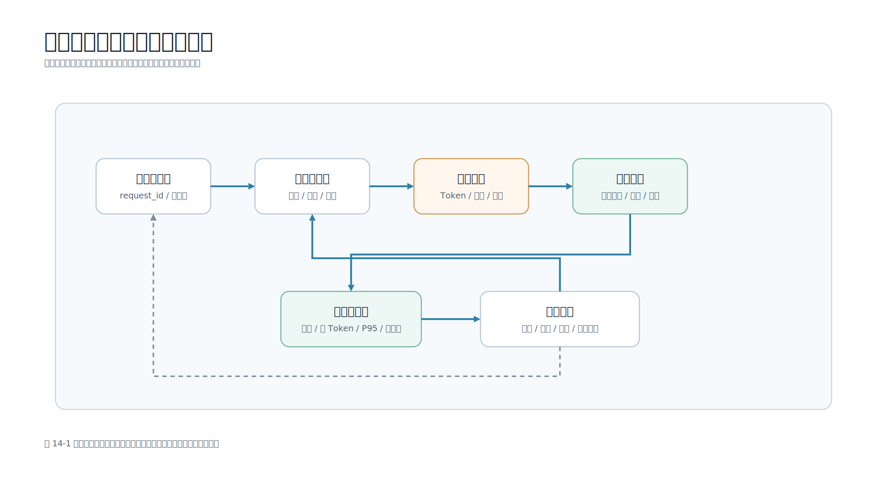

# 第 14 章 成本、性能与稳定性优化

## 本章导读

大模型应用能跑起来只是第一步。上线后，团队很快会遇到三个问题：一次回答花多少钱，用户要等多久，模型服务异常时 App 会不会卡死或重复扣费。对移动端开发工程师来说，这些问题最终都会落到页面状态、首 Token、取消、弱网重试、错误提示和埋点。

图 14-1 展示了成本、性能和稳定性的观测闭环。



配套脚本：`examples/01-mobile-knowledge-assistant/scripts/ops_report.py`

## 学习目标

- 理解成本由输入 Token、输出 Token、模型单价、调用次数和附加链路组成。
- 区分首 Token 时间、完整回答耗时、P50、P95 和 SLO。
- 设计稳定且不泄露原文的缓存 Key。
- 区分可重试错误、不可重试错误和需要人工排查的异常。
- 运行 `ops_report.py`，读懂成本、性能和稳定性指标。

## 14.1 成本从哪里来

大模型成本不只是一行“模型调用费”。一个 RAG 应用可能包含主模型输入和输出 Token、Embedding、向量库、重排模型、文件解析、对象存储、日志、评测、监控和告警成本。

降低成本的顺序通常是：

1. 减少无关上下文，避免把整篇文档塞进 Prompt。
2. 限制输出长度，让模型回答到业务需要的位置就停止。
3. 对稳定问题使用缓存。
4. 用小模型处理分类、路由、标题生成等简单任务。
5. 把离线批处理和实时交互分开。

用户退出页面后仍继续生成，是移动端常见成本浪费。取消按钮不只是体验控件，也是成本控制手段。

## 14.2 Token 成本估算

示例价格表在 `data/observability/model_pricing.json`：

```json
{
  "fast-chat": {
    "input_per_1k_usd": 0.0003,
    "output_per_1k_usd": 0.0009
  }
}
```

价格只是教学样例，真实项目必须以模型提供方当前账单口径为准。成本估算公式：

```python
input_cost = record.prompt_tokens / 1000 * price.input_per_1k_usd
output_cost = record.completion_tokens / 1000 * price.output_per_1k_usd
```

模型网关应记录：

| 字段 | 作用 |
| --- | --- |
| `request_id` | 串联移动端、服务端、模型网关和日志 |
| `route` | 区分普通问答、流式问答、批处理 |
| `model` | 区分模型版本和路由策略 |
| `prompt_tokens` | 输入 Token 数 |
| `completion_tokens` | 输出 Token 数 |
| `first_token_ms` | 首段内容返回耗时 |
| `latency_ms` | 完整请求耗时 |
| `status_code` | 网关或上游返回状态 |
| `cache_hit` | 是否命中缓存 |
| `fallback_used` | 是否使用降级方案 |

没有这些字段，就很难判断成本上涨来自用户增长、Prompt 变长、模型变贵还是缓存失效。

## 14.3 延迟指标

大模型应用的延迟不是一个数字。一次 RAG 请求通常包含移动端发起请求、服务端鉴权、检索、Prompt 构造、模型排队和生成、流式返回、移动端渲染等阶段。

| 指标 | 含义 | 适用判断 |
| --- | --- | --- |
| 首 Token 时间 | 点击发送到第一段内容出现 | 用户是否觉得有响应 |
| 完整回答耗时 | 发送到 `done` 事件 | 长回答是否可接受 |
| P50 延迟 | 一半请求不超过该值 | 常规体验 |
| P95 延迟 | 95% 请求不超过该值 | 尾部体验和 SLO |
| SLO 违规率 | 超过目标阈值的请求比例 | 是否需要容量或降级 |

运行报表：

```bash
cd examples/01-mobile-knowledge-assistant
python3 scripts/ops_report.py --latency-slo-ms 3000
```

报告会输出请求数、成功率、错误率、缓存命中率、重试率、降级率、总成本、P50、P95、首 Token 和告警。真实项目可以把同样字段接入 Prometheus、Grafana、Datadog、OpenTelemetry 或公司内部监控平台。

## 14.4 缓存 Key 不能暴露隐私

缓存适合稳定问题、公开知识、低风险摘要和重复查询。不适合权限相关结果、实时状态、用户隐私内容和强时效答案。

不要直接用用户问题作为缓存 Key。Key 中可能包含手机号、订单号、内部信息；Prompt 或知识库版本变更后，旧缓存也可能继续命中。

示例函数：

```python
def stable_cache_key(
    question: str,
    prompt_version: str,
    kb_version: str,
    tenant_id: str,
    permission_scope: str,
    locale: str = "zh-CN",
) -> str:
    payload = {
        "question": " ".join(question.split()),
        "prompt_version": prompt_version.strip(),
        "kb_version": kb_version.strip(),
        "tenant_id": tenant_id.strip(),
        "permission_scope": permission_scope.strip(),
        "locale": locale.strip(),
    }
    raw = json.dumps(payload, ensure_ascii=False, sort_keys=True, separators=(",", ":"))
    return hashlib.sha256(raw.encode("utf-8")).hexdigest()[:32]
```

要点：使用稳定哈希；把 Prompt 版本、知识库版本、租户和权限范围放进 Key；不要把原始问题直接作为缓存系统里的明文名称。

## 14.5 重试与降级

模型 API 调用失败时，不能一律重试。

| 状态 | 建议动作 | 原因 |
| --- | --- | --- |
| 408、425、429、500、502、503、504 | 可重试 | 可能是临时超时、限流或上游故障 |
| 400、401、403、404、422 | 快速失败 | 参数、认证、权限或资源不存在 |
| 其他未知状态 | 人工排查或降级 | 避免自动重试放大问题 |

重试应发生在服务端或模型网关受控层，并使用退避和 jitter。移动端弱网重连不能直接重复创建生成任务。所有请求都要携带 `request_id`，页面只接受当前 request_id 的事件。

降级策略要提前设计：

- 命中缓存结果。
- 使用较小或更便宜的模型。
- 关闭重排或减少 Top-K。
- 返回“稍后重试”并保留用户输入。
- 创建工单或转人工处理。

移动端也要区分这些状态。限流、权限错误、模型不可用、用户取消，对应不同文案和下一步动作。

## 14.6 移动端如何配合优化

移动端不持有模型 Key，但会影响成本、性能和稳定性。

页面状态至少区分：

- `idle`：没有请求。
- `submitting`：请求已发出，还没有首 Token。
- `streaming`：正在接收片段。
- `completed`：收到 `done`。
- `failed`：收到 `error` 或请求失败。
- `cancelled`：用户停止或页面退出。

取消要同时发生在三层：页面停止追加文本，服务端标记 request_id 取消，上游模型网关尽量停止生成。即使网关不能真正中断推理，服务端也要避免继续把旧片段推给移动端。

移动端埋点要带同一个 `request_id`：点击发送、首 Token 到达、点击停止、收到终态、页面退出、App 后台、网络切换、引用展开、复制、反馈和重新生成。它们和服务端日志结合，才能定位问题发生在 App 网络层、服务端检索、模型网关还是上游模型。

## 14.7 发布前检查

发布前至少完成：

1. 跑完整单元测试和接口测试。
2. 跑 `rag_eval.py` 和 `answer_eval.py`，确认质量没有退化。
3. 跑 `ops_report.py` 或真实监控查询，确认成本、首 Token 和 P95 没有明显异常。
4. 检查 Prompt、Top-K、模型和知识库版本是否写入日志。
5. 检查缓存 Key 是否包含版本信息，且不暴露原始隐私。
6. 检查 429、5xx、超时、取消和降级路径。
7. 检查移动端弱网、后台、页面退出和重复发送。

早期可以先生成报告；等指标稳定后，再把关键项接入 CI 或发布系统。

## 本章小结

大模型应用上线后，成本、性能和稳定性会直接决定产品能否持续运行。控制成本要从 Token、上下文、缓存和取消开始；优化性能要关注首 Token 和 P95；提高稳定性要区分可重试错误、不可重试错误和降级路径。App 的状态机、取消逻辑、弱网恢复、埋点和错误展示，都会影响模型调用成本和用户体验。

## 实践练习

1. 修改 `model_call_logs.json` 中某条请求的 `latency_ms`，观察 `alerts` 变化。
2. 修改 `stable_cache_key()` 的 `tenant_id` 和 `permission_scope`，解释为什么不能省略。
3. 把 `retry_schedule(4)` 改成带 jitter 的版本。
4. 设计移动端消息状态对象，包含 `request_id`、`state`、`first_token_at`、`finished_at`、`error_code`。
5. 为一个模型接口设计缓存、小模型、减少 Top-K、转人工等降级策略。
