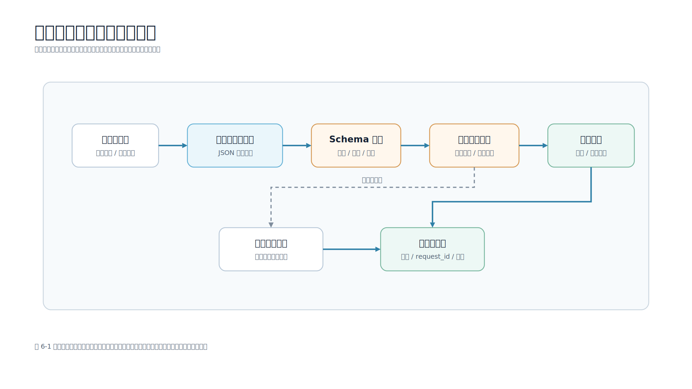

# 第 6 章 结构化输出与工具调用

## 本章导读

前面几章已经说明，大模型擅长理解自然语言，也能生成看起来很流畅的回答。但业务系统不能只消费“看起来合理”的文字。移动端 App 最终要更新页面状态、展示卡片、调用服务端接口、创建工单或进入确认流程。这些动作需要明确字段、稳定类型和可审计的工具调用，而不是一段自由文本。

例如用户说“帮我查一下订单 A1024 到哪里了”，模型可以回答“订单已经发货”。人能看懂，但程序很难判断这个回答来自哪个订单、是否已经校验用户权限、是否应该展示物流卡片。工程系统更需要的是一个受约束的结构化结果：

```json
{
  "tool_name": "query_order",
  "arguments": {
    "order_id": "A1024"
  },
  "requires_confirmation": false
}
```

图 6-1 展示了结构化输出和工具调用的工程边界。



本章配套新增 `scripts/structured_tool_router.py` 和 `data/tools/orders.json`。脚本模拟一个移动端订单助手：模型只负责产出 JSON 工具请求，服务端负责 JSON Schema 校验、工具白名单、订单归属检查和高风险动作确认。它默认不调用真实模型服务，因此读者不需要 API 密钥（API Key）就能跑通结构化输出与工具调用的完整链路。

## 学习目标

- 理解为什么结构化输出是大模型进入工程系统的关键边界。
- 能够用 JSON Schema 描述字段、类型、枚举、必填项和额外字段限制。
- 知道模型输出必须经过服务端校验，不能直接进入业务工具。
- 能够区分只读工具和高风险工具，并设计移动端确认卡。
- 能够运行配套脚本，观察查询订单、越权访问、取消订单确认和工具调用审计。
- 知道移动端、服务端、模型和业务系统在工具调用中的职责分工。

## 核心内容

### 6.1 自然语言不能直接驱动业务动作

自然语言回答适合给人看，不适合直接给程序执行。原因有 4 个：

- 字段不稳定：模型可能一会儿说“订单号”，一会儿说“编号”。
- 类型不稳定：金额、日期、布尔值可能被写成自然语言。
- 边界不稳定：模型可能顺手补充没有依据的信息。
- 风险不稳定：模型可能把“查询”误判成“取消”或“退款”。

移动端应用尤其依赖稳定结构。一个聊天页面可以展示自然语言，但订单详情页、确认弹窗、错误状态和埋点都需要明确字段。例如页面需要知道：

| 字段 | 页面用途 |
| --- | --- |
| `tool_name` | 决定调用哪个服务端工具 |
| `arguments.order_id` | 展示订单号并查询业务数据 |
| `requires_confirmation` | 模型给出的风险建议，服务端策略会重新判断 |
| `tool_result.mobile_confirmation.risk_level` | 服务端确认卡的风险等级，决定按钮样式和提示强度 |
| `tool_result.status` | 决定完成、失败、无权限或等待确认状态 |

结构化输出不是为了让模型“看起来更像程序”，而是为了让模型输出进入可校验、可测试、可审计的工程链路。

### 6.2 JSON Schema 描述的是最低合格线

JSON Schema 可以描述对象结构、字段类型、必填项、枚举值和额外字段限制。配套脚本中的工具调用 Schema 如下：

```python
TOOL_CALL_SCHEMA = {
    "type": "object",
    "required": ["tool_name", "arguments", "requires_confirmation"],
    "additionalProperties": False,
    "properties": {
        "tool_name": {
            "type": "string",
            "enum": ["query_order", "request_order_cancellation"],
        },
        "arguments": {
            "type": "object",
            "required": ["order_id"],
            "additionalProperties": False,
            "properties": {
                "order_id": {"type": "string"},
                "reason": {"type": "string"},
            },
        },
        "requires_confirmation": {"type": "boolean"},
    },
}
```

这里有几个细节值得注意。

第一，`tool_name` 使用枚举，防止模型随意输出 `delete_order`、`refund_money` 或其他未授权工具。工具能不能调用，不由模型决定，而由服务端白名单决定。

第二，`required` 要写清楚。缺少 `order_id` 的工具调用不能进入业务系统。配套脚本还会校验订单号格式；真实项目应继续校验租户、用户身份和资源归属。

第三，`additionalProperties: False` 很重要。它能阻止模型把额外字段写入参数中。例如模型输出 `{"admin": true}`，服务端不应该忽略后继续执行，因为这类字段可能代表提示注入、越权意图或模型误解。

Schema 只是最低合格线。通过 Schema 不代表可以执行工具，它只说明“结构看起来像工具请求”。权限、状态、风险等级和确认卡仍然要由服务端业务代码判断。

其中，`requires_confirmation` 只用于记录和审计模型的风险建议，不参与最终执行决策。是否需要确认，以服务端 `TOOL_POLICIES` 为准。

### 6.3 配套脚本的执行流程

运行示例：

```bash
cd examples/mobile-knowledge-assistant
python3 scripts/structured_tool_router.py \
  --message '帮我查一下订单 A1024 到哪里了' \
  --user-id user_001
```

脚本会执行 5 个步骤：

1. 用确定性适配器模拟模型输出结构化 JSON。
2. 用 `TOOL_CALL_SCHEMA` 校验字段、类型、枚举和额外字段。
3. 把 JSON 转换为内部 `ToolCall` 对象。
4. 通过服务端工具策略完成白名单、权限、状态和确认判断。
5. 返回工具结果和审计字段。

典型输出节选：

```json
{
  "model_output": {
    "tool_name": "query_order",
    "arguments": {
      "order_id": "A1024"
    },
    "requires_confirmation": false
  },
  "tool_result": {
    "ok": true,
    "status": "success",
    "payload": {
      "order_id": "A1024",
      "status": "shipped",
      "carrier": "SF Express"
    }
  },
  "audit": {
    "tool_name": "query_order",
    "model_requires_confirmation": false,
    "server_requires_confirmation": false,
    "executed": true
  }
}
```

这里的“模型输出”由 `mock_model_structured_output()` 生成。它不是为了假装模型能力，而是为了让读者在没有 API 密钥的情况下跑通同样的工程边界。把它替换成真实模型时，后面的 Schema 校验、白名单、权限和确认流程不应该删除。

### 6.4 应用层校验不能省略

有些模型服务支持 `response_format` 或工具调用参数约束，但应用层仍然要校验。原因很简单：模型服务保证的是输出形状，业务系统要保证的是执行安全。

配套脚本实现了一个小型 JSON Schema 子集校验器：

```python
def validate_json_schema(value: Any, schema: dict[str, Any], path: str = "$") -> None:
    expected_type = schema.get("type")
    if expected_type == "object":
        if not isinstance(value, dict):
            raise ValueError(f"{path} must be an object")
        for field in schema.get("required", []):
            if field not in value:
                raise ValueError(f"{path}.{field} is required")
        properties = schema.get("properties", {})
        if schema.get("additionalProperties") is False:
            extra = sorted(set(value) - set(properties))
            if extra:
                raise ValueError(f"{path} has unexpected fields: {', '.join(extra)}")
        for field, child_schema in properties.items():
            if field in value:
                validate_json_schema(value[field], child_schema, f"{path}.{field}")
        return

    if expected_type == "string":
        if not isinstance(value, str):
            raise ValueError(f"{path} must be a string")
    elif expected_type == "boolean":
        if not isinstance(value, bool):
            raise ValueError(f"{path} must be a boolean")
    else:
        raise ValueError(f"unsupported schema type at {path}: {expected_type}")

    enum = schema.get("enum")
    if enum is not None and value not in enum:
        raise ValueError(f"{path} must be one of: {', '.join(map(str, enum))}")
```

生产项目可以使用成熟 JSON Schema 库，但本书示例保留简化实现，是为了让读者看清楚校验到底在做什么。关键原则是：模型输出不能因为“像 JSON”就被信任。

校验失败时，常见处理方式有 3 种：

- 让模型重新生成一次，并把校验错误作为上下文。
- 返回错误给调用方，让移动端展示“无法理解该请求”。
- 把样本记录到评测集，后续优化 Prompt 或模型路由。

不要在校验失败后猜测字段含义继续执行。比如缺少 `order_id` 或订单号格式不合法时，服务端不应从历史会话里随便找一个订单号执行，因为这会放大误操作风险。本章脚本会返回 `invalid_arguments`，移动端可以据此引导用户补充订单号。

### 6.5 工具调用必须经过白名单

工具调用的本质是让模型影响业务系统。只要涉及业务系统，就必须有白名单。

配套脚本的分发逻辑如下：

```python
TOOL_POLICIES = {
    "query_order": {"requires_confirmation": False, "risk_level": "none"},
    "request_order_cancellation": {"requires_confirmation": True, "risk_level": "high"},
}

if call.name not in TOOL_POLICIES:
    raise ValueError(f"tool is not allowed: {call.name}")

try:
    order_id = _required_argument(call, "order_id")
except ValueError as exc:
    return {"ok": False, "status": "invalid_arguments", "message": str(exc)}

if call.name == "query_order":
    return query_order(orders, user_id, order_id)

preflight = _preflight_order_cancellation(orders, user_id, order_id)
if not preflight["ok"]:
    return preflight
if _requires_confirmation(call.name) and not confirmed:
    return {
        "ok": False,
        "status": "confirmation_required",
        "mobile_confirmation": _build_mobile_confirmation(call.name, order_id),
    }
```

这比在 Prompt 中写“不要调用危险工具”可靠得多。Prompt 是给模型看的，白名单是服务端强制执行的边界。即使模型输出了 `delete_order`，服务端也会拒绝。

工具还要分级：

| 工具类型 | 示例 | 是否需要确认 |
| --- | --- | --- |
| 只读查询 | 查询订单、查询物流、读取知识库 | 通常不需要 |
| 低风险写入 | 创建草稿、添加待办、保存临时备注 | 视业务而定 |
| 高风险动作 | 取消订单、退款、删除数据、发布配置 | 必须确认 |

移动端开发者要关心的不只是工具是否执行成功，还要关心工具处于哪个风险等级。不同风险等级应该对应不同 UI：只读查询可以直接返回结果，高风险动作要展示确认卡，失败或越权要展示明确原因。风险等级不能由模型直接决定，应由服务端工具策略绑定。

### 6.6 权限检查在工具执行前完成

工具调用不能绕过业务权限。配套数据 `data/tools/orders.json` 中，订单 `B2048` 属于 `user_002`。如果 `user_001` 查询它：

```bash
python3 scripts/structured_tool_router.py \
  --message '帮我查一下订单 B2048' \
  --user-id user_001
```

结果会返回：

```json
{
  "tool_result": {
    "ok": false,
    "status": "forbidden",
    "message": "当前用户无权访问该订单"
  }
}
```

这说明权限判断发生在工具执行前。模型识别出订单号，并不代表当前用户有权查看。生产系统中，权限维度可能包括用户 ID、租户 ID、团队、角色、数据范围和文档可见性。不要让模型回答“用户应该可以查看”，权限只能由业务系统判断。

### 6.7 高风险动作需要移动端确认

取消订单属于高风险动作。即使模型正确识别了用户意图，服务端也不能直接执行。脚本会先检查参数、订单归属和订单状态；如果订单不存在、当前用户无权访问，或者订单已经不可取消，服务端会直接返回 `not_found`、`forbidden` 或 `not_cancellable`，不会先展示确认卡。

当前置检查通过后，运行：

```bash
python3 scripts/structured_tool_router.py \
  --message '我要取消订单 P3001' \
  --user-id user_001
```

脚本会返回 `confirmation_required`，并带上服务端生成的移动端确认卡信息：

```json
{
  "tool_result": {
    "ok": false,
    "status": "confirmation_required",
    "mobile_confirmation": {
      "title": "确认取消订单",
      "message": "取消订单 P3001，可能影响发货或退款，请用户确认后再执行。",
      "risk_level": "high"
    }
  }
}
```

移动端页面应该把这类结果展示为确认卡，而不是普通文本。确认卡至少包含：

- 将要执行的动作。
- 影响对象，例如订单号。
- 风险说明。
- 取消按钮和确认按钮。
- 是否需要再次输入密码、验证码或生物识别。

用户确认后，移动端再发起带确认态的请求。本章脚本用 `--confirm` 模拟这个动作。生产系统中，确认态应绑定 `request_id` 或 `confirmation_id`，并在服务端设置过期时间和幂等保护，不能只依赖页面上的按钮状态。

```bash
python3 scripts/structured_tool_router.py \
  --message '我要取消订单 P3001' \
  --user-id user_001 \
  --confirm
```

示例不会写回订单文件，而是返回 `cancellation_requested`。这样读者可以理解“已提交取消申请”的业务状态，同时避免示例脚本修改本地数据。

### 6.8 移动端状态如何设计

结构化输出和工具调用最终都会落到移动端状态机。建议至少区分以下状态：

| 状态 | 含义 | 页面表现 |
| --- | --- | --- |
| `parsing` | 正在理解用户请求 | 输入区禁用或显示加载 |
| `tool_calling` | 服务端正在执行只读工具 | 显示“正在查询订单” |
| `waiting_confirmation` | 高风险动作等待用户确认 | 展示确认卡 |
| `success` | 工具执行成功 | 展示结果卡片 |
| `forbidden` | 无权访问目标资源 | 展示权限错误 |
| `invalid_arguments` | 参数缺失或格式错误 | 引导用户补充信息 |
| `failed` | 工具或服务异常 | 展示重试入口 |

注意，不要把服务端返回的所有状态都塞进一个“模型回答失败”。`forbidden`、`confirmation_required`、`not_cancellable` 和 `not_found` 对用户意味着完全不同的下一步动作。

确认卡还需要一组清晰的状态迁移规则：

| 迁移 | 服务端要求 | 移动端处理 |
| --- | --- | --- |
| `tool_calling` -> `waiting_confirmation` | 参数、权限和业务状态前置检查通过，并生成 `confirmation_id` | 展示确认卡，禁用重复提交 |
| `waiting_confirmation` -> `tool_calling` | 用户点击确认，提交原 `request_id` 或 `confirmation_id` | 展示处理中，不重新让模型推理同一意图 |
| `waiting_confirmation` -> `cancelled` | 用户取消、页面退出或确认过期 | 移除确认卡，必要时记录埋点 |
| `tool_calling` -> `success` | 服务端确认后再次校验权限和状态并执行成功 | 展示结果卡 |
| `tool_calling` -> `failed` | 二次校验失败、幂等冲突或业务系统异常 | 展示具体错误和重试策略 |

一个移动端确认卡对象可以这样设计：

```json
{
  "card_type": "tool_confirmation",
  "request_id": "req_001",
  "confirmation_id": "confirm_001",
  "tool_name": "request_order_cancellation",
  "title": "确认取消订单",
  "risk_level": "high",
  "expires_at": "2026-06-21T10:15:00+08:00",
  "primary_action": "确认取消",
  "secondary_action": "返回"
}
```

这个对象应由服务端返回，移动端负责展示和收集用户确认。移动端不应该自行拼装高风险工具参数，更不应该绕过服务端直接调用业务系统。

### 6.9 从本地脚本迁移到真实模型

真实模型接入后，流程仍然不变：

1. Prompt 要告诉模型只能输出指定 JSON 或工具调用。
2. 模型服务最好开启结构化输出或工具调用模式。
3. 服务端用 Schema 再校验一次。
4. 服务端把工具名映射到白名单。
5. 服务端根据工具策略绑定风险等级和确认要求。
6. 服务端做参数、权限和业务状态前置检查。
7. 高风险动作返回服务端生成的确认卡。
8. 用户确认后，服务端再次校验并执行工具。
9. 工具结果进入审计日志和移动端状态机。

不要把结构化输出理解成“模型已经可靠”。它只是把不稳定自然语言收束成更容易校验的格式。真正的可靠性来自多层边界：Schema、白名单、权限、确认、审计和测试。

## 本章小结

结构化输出让模型结果能够进入程序流程，工具调用让大模型应用连接真实业务系统。但模型不能直接执行业务动作。移动端负责交互、状态展示和用户确认；服务端负责结构校验、工具白名单、权限判断、业务执行和审计。

本章配套脚本用订单查询和取消申请展示了一个最小但真实的工具调用闭环。本章需要掌握的是：JSON Schema 是入口检查，工具白名单是能力边界，权限检查是业务边界，移动端确认是用户边界。少掉任何一层，工具调用都会从“智能助手”变成不受控的风险入口。

## 实践练习

1. 在 `TOOL_CALL_SCHEMA` 中为 `order_id` 增加格式校验说明，并在服务端补充确定性校验。
2. 新增一个只读工具 `list_recent_orders`，要求只能返回当前用户自己的订单。
3. 为 `request_order_cancellation` 增加取消原因枚举，例如 `duplicate_order`、`wrong_address`、`no_longer_needed`。
4. 设计移动端确认卡的 UI 状态，分别处理 `confirmation_required`、`forbidden` 和 `not_cancellable`。
5. 把本章脚本接入真实模型提供方时，列出仍然必须保留在服务端的校验步骤。
