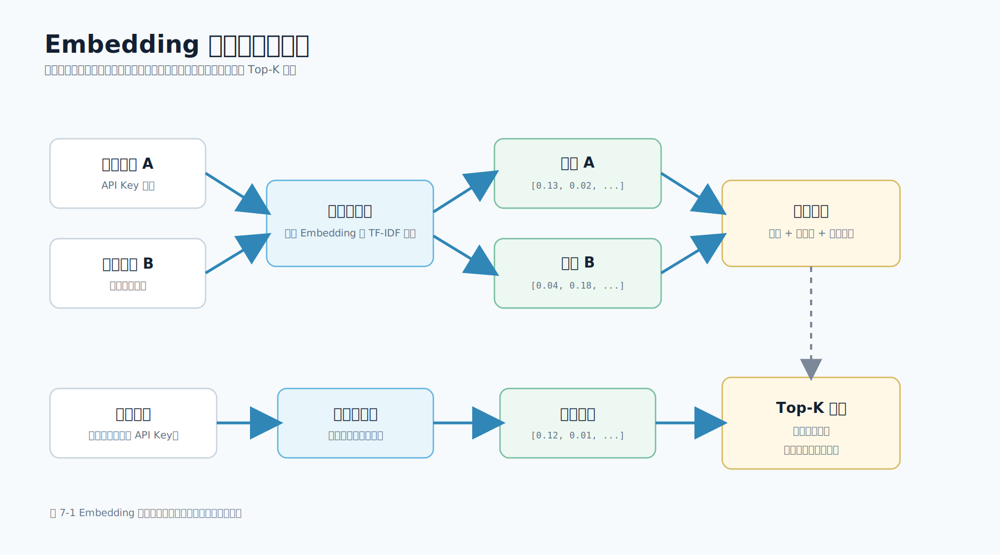

# 第 7 章 Embedding 与向量检索

## 本章导读

RAG 的第一步不是生成，而是检索。检索做得不好，模型后面的回答再流畅，也只是基于错误资料进行润色。Embedding（嵌入向量）和向量检索的作用，就是把文本、图片、日志等内容转换成可以计算相似度的数字表示，让系统能够从知识库中找出和用户问题最相关的片段。

对于移动端开发工程师来说，Embedding 不需要从数学推导开始理解。更实用的理解方式是：把一句话、一个文档片段或一张图片映射成一组数字，语义越接近，向量空间中的方向越接近。这样，当用户在 App 中问“为什么客户端不能保存模型密钥”时，即使知识库原文写的是“移动端 App 不应该直接保存模型 API Key”，系统也能把这两段内容联系起来。

图 7-1 展示了从文档片段到向量索引，再到用户问题召回 Top-K 片段的流程。



本章会先解释 Embedding 和向量检索的直觉，再通过配套工程中的标准库脚本 `scripts/tfidf_vector_search.py` 观察一次可运行的本地向量检索。这个脚本使用 TF-IDF 向量和余弦相似度，不依赖外部模型服务。它不是生产 Embedding 模型，但它真实执行了“向量化、归一化、相似度排序、Top-K 返回”这条链路，适合用来理解机制。

## 学习目标

- 理解 Embedding 如何把文本转换成可计算的向量表示。
- 说清楚关键词检索、TF-IDF 向量检索和神经网络 Embedding 检索的差异。
- 掌握文档切分、向量化、元数据、权限过滤和 Top-K 召回的基本流程。
- 能够运行配套工程中的 TF-IDF 向量检索脚本，观察分数、片段和引用来源。
- 知道移动端接入向量检索时，应把模型密钥、向量库和权限判断放在服务端。

## 7.1 为什么移动端开发者要关心向量检索

很多移动端 AI 功能看起来是“问模型一个问题”，实际工程链路却是“先找资料，再让模型回答”。典型场景包括：

| 场景 | 用户输入 | 检索目标 |
| --- | --- | --- |
| 开发者助手 | “API Key 能不能放 App 里？” | 安全接入规范 |
| 崩溃分析 | “这个堆栈像什么问题？” | 崩溃排查手册、历史工单 |
| 隐私审查 | “相册权限什么时候申请？” | 权限与隐私政策 |
| 客服知识库 | “会员退款规则是什么？” | FAQ、运营规则 |
| 内部工具 | “这个配置字段怎么填？” | 后台配置说明 |

这些场景有一个共同点：答案必须基于业务资料，而不是只依赖模型常识。移动端开发者关心的是页面体验、接口延迟、错误处理和引用展示，但这些体验背后依赖检索质量。如果检索没有召回正确片段，移动端只能展示一个“看起来合理、实际上无依据”的回答。

传统关键词检索适合精确词匹配。例如用户问“API Key”，资料里也有 “API Key”，通常能找对。但如果用户问“模型密钥为什么不能写进客户端”，而资料里写的是“移动端 App 不应该直接保存模型 API Key”，纯关键词检索就可能受表达差异影响。向量检索的目标是让系统理解“模型密钥”和“API Key”在这个上下文里语义接近。

这并不意味着关键词检索应该被淘汰。真实系统常常使用混合检索：关键词检索保证专有名词、错误码、接口名、日志字段不丢；向量检索负责召回语义相近但字面不同的表达；重排模型再对候选片段做精排。对移动端知识助手而言，最常见的演进路径是：

1. 用本地关键词检索跑通 RAG 闭环。
2. 用 TF-IDF 或 BM25 观察检索分数和排序。
3. 接入真实 Embedding 模型和向量库。
4. 加入权限过滤、混合检索和重排。
5. 用评测集持续监控召回率和引用准确率。

## 7.2 Embedding 的直觉

Embedding 是把文本、图片、音频或其他对象转换成向量的方法。向量可以理解为一串数字，例如：

```text
[0.12, -0.03, 0.44, ..., 0.08]
```

真实 Embedding 通常有几百到几千维。每一维很难直接对应“安全”“权限”“崩溃”这样的人工概念，但整体方向可以表达语义特征。两个文本越相近，它们的向量方向通常越接近。

可以用一个简化例子理解：

| 文本 | 可能靠近的语义区域 |
| --- | --- |
| “移动端 App 不应该保存模型 API Key” | 安全、密钥、服务端代理 |
| “客户端不能把模型密钥写进安装包” | 安全、密钥、服务端代理 |
| “流式输出要逐步追加到消息气泡” | SSE、交互体验、消息状态 |
| “相册权限必须说明用途” | 隐私、权限、合规 |

第一句和第二句字面不同，但语义接近。Embedding 的价值就在于把这种接近关系转换成可计算的相似度。

需要注意 3 个边界：

- Embedding 不是答案。它只帮助系统找到相关资料，不能替代生成模型。
- Embedding 不等于权限判断。用户能不能看到某段资料，必须由业务系统过滤。
- Embedding 不是一次性工作。文档更新、模型版本变化、切分策略调整后，都可能需要重建索引。

## 7.3 相似度：为什么常用余弦相似度

向量检索需要回答一个问题：查询向量和文档向量有多接近？常见做法是计算余弦相似度（cosine similarity）。它关注两个向量的方向是否接近，而不是只看长度。

在文本检索中，向量长度可能受到片段长短、词频和模型输出尺度影响。余弦相似度先把向量归一化，再计算方向接近程度。配套脚本中的核心逻辑如下：

```python
def _normalize(vector: dict[str, float]) -> dict[str, float]:
    norm = math.sqrt(sum(value * value for value in vector.values()))
    if norm == 0:
        return {}
    return {term: value / norm for term, value in vector.items()}


def _dot(left: dict[str, float], right: dict[str, float]) -> float:
    if len(left) > len(right):
        left, right = right, left
    return sum(value * right.get(term, 0.0) for term, value in left.items())
```

`_normalize()` 把向量缩放到单位长度，`_dot()` 计算两个稀疏向量的点积。因为向量已经归一化，点积就可以作为余弦相似度。得分越高，表示查询和文档片段越接近。

对于移动端业务，分数不应该直接展示给普通用户。分数更适合用于调试、评测和运营后台。用户真正需要看到的是答案、引用来源、资料标题、更新时间和反馈入口。

## 7.4 离线索引与在线查询

向量检索通常分为离线索引和在线查询两条链路。

离线索引负责把资料变成可检索数据：

1. 收集文档，例如 Markdown、PDF、接口文档、隐私政策、工单记录。
2. 清洗内容，去除重复导航、过期段落、隐私字段和无意义日志。
3. 切分片段，让每个片段既足够完整，又不会过长。
4. 生成向量，使用 Embedding 模型或本章的 TF-IDF 向量化方法。
5. 写入索引，保存向量、正文、标题、章节、权限标签和更新时间。

在线查询负责根据用户问题召回资料：

1. 移动端提交问题和 `request_id`。
2. 服务端确认用户身份、租户和资料访问范围。
3. 服务端把问题转换成查询向量。
4. 向量库或本地索引计算相似度。
5. 返回 Top-K 片段给 RAG 服务层。
6. RAG 服务层构造 Prompt 并调用模型。
7. 移动端展示答案和引用来源。

两条链路的稳定性要求不同。离线索引可以接受异步重建、失败重试和批量任务；在线查询必须关注延迟、超时、降级和用户体验。移动端页面不应该直接等待一个不可控的向量库或模型供应商接口，而应该调用自有服务端，由服务端统一处理超时和错误码。

## 7.5 文档切分和元数据

切分粒度决定了模型最终能看到什么资料。片段太短，缺少上下文；片段太长，带入无关内容并浪费 Token。移动端技术文档通常适合按标题和段落切分，因为标题天然表达结构。

配套工程使用 `load_markdown_chunks()` 读取 Markdown，并把文档拆成 `DocumentChunk`：

```python
@dataclass(frozen=True)
class DocumentChunk:
    source: str
    title: str
    section: str
    text: str
```

这 4 个字段覆盖了最小可用引用来源：

| 字段 | 作用 | 移动端展示方式 |
| --- | --- | --- |
| `source` | 原始文档文件 | 调试或后台展示 |
| `title` | 文档标题 | 引用卡片主标题 |
| `section` | 章节标题 | 引用卡片副标题 |
| `text` | 片段正文 | 展开后显示原文片段 |

生产系统还应增加更多元数据：

| 元数据 | 用途 |
| --- | --- |
| `doc_id` | 稳定定位文档，避免文件名变化影响引用 |
| `chunk_id` | 定位具体片段，便于评测和反馈 |
| `updated_at` | 判断资料是否过期 |
| `visibility` | 做公开、内部、团队、个人范围过滤 |
| `owner_team` | 反馈和资料维护责任人 |
| `url` | 跳转到完整文档或后台详情 |

权限过滤必须发生在资料进入 Prompt 之前。更稳妥的做法是在检索前或检索条件中完成过滤；如果向量库暂时无法前置过滤，就要由服务端过量召回、严格二次过滤，并补足候选片段。关键原则是：无权内容不能进入 Prompt，也不能返回移动端。移动端侧不应依赖隐藏 UI 来做权限控制，因为网络响应已经包含了数据。

## 7.6 从本地关键词检索到向量检索

下一章将使用 `LocalRetriever` 跑通知识问答闭环。它通过中英文 Token 和中文二元字符组合计算重叠度，优点是零依赖、可测试、便于理解；缺点是语义泛化能力有限。

本章新增的 `scripts/tfidf_vector_search.py` 进一步把检索过程表达为向量计算。它读取同一批 Markdown 文档，计算每个片段的词频和 IDF 权重，把查询也转换成向量，然后用余弦相似度排序。核心类如下：

```python
class TfidfVectorIndex:
    """A small, dependency-free vector index for explaining retrieval mechanics.

    The vector is not a neural Embedding. It is a TF-IDF vector built from the
    local Markdown corpus, which makes the same indexing, normalization and
    cosine-similarity steps visible before readers replace it with a production
    Embedding model and vector database.
    """
```

这段注释很重要。TF-IDF 向量不是神经网络 Embedding，但它是真实的向量检索：有词项权重、有向量维度、有归一化、有相似度、有 Top-K。学习时先用它观察机制，比一开始直接接入黑盒向量库更容易建立正确直觉。

神经网络 Embedding 和 TF-IDF 的差异可以这样理解：

| 维度 | TF-IDF 向量 | 神经网络 Embedding |
| --- | --- | --- |
| 向量来源 | 从当前语料统计词项权重 | 由训练好的模型生成 |
| 语义泛化 | 较弱，依赖字面或分词重叠 | 较强，能捕捉近义表达 |
| 可解释性 | 较强，可以看到词项权重 | 较弱，维度不易解释 |
| 运行成本 | 低，可本地运行 | 需要模型服务或本地模型 |
| 适合阶段 | 学习、调试、小语料基线 | 生产 RAG、语义检索、多模态检索 |

正式项目通常会使用神经网络 Embedding。但在工程落地时，保留一个关键词或 TF-IDF 基线很有价值。它可以帮助团队判断问题到底来自资料质量、切分策略、语义模型还是 Prompt 生成。

理解上述机制后，可以通过配套脚本观察一次完整的本地向量检索。

## 7.7 运行本地 TF-IDF 向量检索

进入配套工程目录：

```bash
cd examples/mobile-knowledge-assistant
```

运行本地向量检索：

```bash
python3 scripts/tfidf_vector_search.py \
  --question '移动端为什么不能直接保存模型 API Key？' \
  --top-k 2
```

典型输出如下。`vector_dimension`、`score` 会随文档内容和切分方式变化，读者不需要追求和书中完全一致。

```json
{
  "question": "移动端为什么不能直接保存模型 API Key？",
  "index_size": 9,
  "vector_dimension": 680,
  "results": [
    {
      "source": "mobile_ai_api.md",
      "title": "移动端 AI 接入指南",
      "section": "API Key 管理",
      "score": 0.4769,
      "snippet": "移动端 App 不应该直接保存模型 API Key。客户端包可以被反编译..."
    }
  ]
}
```

这段输出要关注 4 个点：

- `index_size` 表示当前知识库被切成多少个片段。
- `vector_dimension` 表示当前向量空间有多少个词项维度。
- `section` 表示召回的是哪一节资料。
- `score` 表示查询向量与文档片段向量的相似度。

如果把问题改成：

```bash
python3 scripts/tfidf_vector_search.py \
  --question '相册权限和麦克风权限应该什么时候申请？' \
  --top-k 2
```

首条结果应更接近 `privacy_review.md` 中的“相册与麦克风权限”。这说明检索不是固定返回某一篇文档，而是根据查询向量重新排序。

## 7.8 如何把脚本替换为生产 Embedding

从本章脚本迁移到生产向量检索时，接口形态可以保持稳定，替换的是向量生成和索引存储。

学习阶段：

```text
Markdown 文档 -> TF-IDF 向量 -> 本地内存索引 -> 余弦相似度排序
```

生产阶段：

```text
Markdown/PDF/网页/工单 -> Embedding 模型 -> 向量库 -> 权限过滤 + Top-K 召回
```

生产向量库通常不会逐条全量比较所有文档向量，而是使用近似最近邻索引加速 Top-K 召回。常见索引包括 HNSW、IVF 等。本书不展开算法细节，读者此处只需要理解：这些索引的作用是用可接受的精度换取更低的查询延迟。

迁移时要注意 5 个工程点。

第一，索引时和查询时必须使用同一个 Embedding 模型和版本。如果离线文档使用模型 A，在线查询使用模型 B，相似度会失去稳定含义。

第二，向量必须和原文片段、元数据一起保存。只保存向量没有意义，移动端最终需要展示引用标题、章节、原文片段和更新时间。

第三，更新文档时要处理旧向量。常见做法是按 `doc_id` 和 `chunk_id` 删除旧片段，再写入新片段；或者保留版本号，并让检索只命中最新可见版本。

第四，权限过滤要发生在资料进入 Prompt 之前。向量库如果支持 metadata filter，应在查询时过滤 `tenant_id`、`visibility`、`owner_team` 等字段；如果不支持，就要过量召回、服务端二次过滤，并补足候选数量。

第五，移动端接口不应该暴露向量库细节。App 只需要知道问题、答案、引用来源、请求状态和错误码，不应该知道向量维度、索引名称或 Embedding 模型密钥。

## 7.9 移动端体验中的检索信号

向量检索看似是服务端能力，但移动端页面需要把检索结果转化为用户可以理解的信号。

| 检索状态 | 移动端表现 |
| --- | --- |
| 找到高置信资料 | 展示答案和引用来源 |
| 找到资料但分数较低 | 提示“可能相关”，鼓励用户确认引用 |
| 没有召回资料 | 明确说明资料不足，不让模型编造 |
| 引用资料过期 | 显示更新时间，并引导反馈 |
| 用户反馈引用错误 | 记录 `request_id`、`chunk_id` 和用户反馈类型 |

移动端不要把“资料不足”伪装成正常回答。对于内部知识助手，最有价值的体验不是永远给出答案，而是在资料不足时明确说“不确定”，并让用户补充文档或提交反馈。这样才能让知识库持续变好。

引用卡片也要控制信息量。建议默认展示标题、章节和一小段摘要，展开后再显示原文片段。对于手机屏幕，过长引用会压缩答案空间；对于平板或桌面端内部工具，可以提供并排的答案和引用视图。

## 7.10 常见问题

**1. 向量检索能不能完全替代关键词检索？**

不建议。接口名、错误码、类名、方法名、订单号、版本号等内容通常更适合关键词检索。生产系统常用混合检索，让关键词和向量互补。

**2. Top-K 应该设成多少？**

没有固定答案。Top-K 太小容易漏资料，太大容易把无关内容塞进 Prompt。移动端知识问答可以从 3 到 5 开始，再用评测集观察召回率、引用准确率、延迟和 Token 成本。

**3. 向量分数低时能不能仍然让模型回答？**

可以，但要明确降级策略。如果资料不足，Prompt 应要求模型说明无法确定。移动端也应展示“资料不足”或“可能相关”的状态，而不是把低置信回答包装成确定答案。

**4. 是否应该在 App 本地做 Embedding？**

多数业务不建议。Embedding 模型、向量索引、权限过滤和密钥管理更适合放在服务端。App 本地可以做轻量缓存、历史问题展示和引用卡片渲染，但不要保存模型密钥或完整内部知识库。

## 本章小结

Embedding 把文本转换成可计算的向量，使系统能够根据语义相似度召回资料。向量检索的关键不只是模型本身，还包括文档清洗、切分、元数据、权限过滤、相似度计算、Top-K 选择和移动端展示。

本章通过 `scripts/tfidf_vector_search.py` 展示了一个标准库可运行的向量检索实验。它不依赖外部模型服务，却完整呈现了索引、向量化、归一化、余弦相似度和结果排序。掌握这条链路后，再接入真实 Embedding 模型和向量库，就不再是照搬工具，而是知道每一步解决什么问题。

## 实践练习

1. 运行 `scripts/tfidf_vector_search.py`，分别查询 API Key、流式输出、相册权限、崩溃日志 4 类问题，观察首条结果是否符合预期。
2. 修改 `data/documents/` 中的任意一篇文档，重新运行脚本，观察 `vector_dimension` 和 `score` 是否变化。
3. 为 `DocumentChunk` 设计 `doc_id`、`chunk_id`、`updated_at`、`visibility` 字段，并说明它们在移动端引用卡片中的用途。
4. 设计一个混合检索方案：关键词召回 20 条、向量召回 20 条、去重后重排 10 条，说明如何把最终 Top-3 返回给 RAG。
5. 思考如果用户没有某篇内部文档权限，检索链路应该在哪一步过滤，移动端应该收到什么错误或空结果状态。
