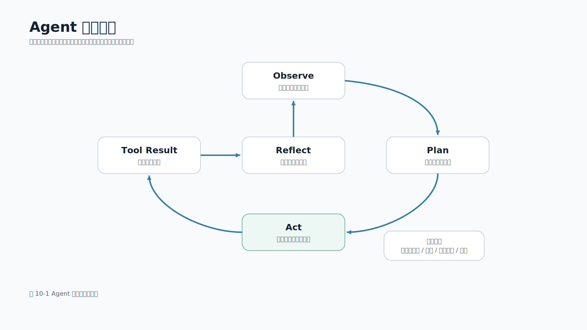

# 第 10 章 Agent 基础

## 本章导读

聊天机器人回答问题，Agent 则围绕目标持续执行：观察当前状态，规划下一步，调用工具，读取工具结果，再决定是否继续。对移动端开发工程师来说，Agent 不应该被理解成“更长的提示词（Prompt）”，而应该理解成“模型、工具、状态、权限和停止条件组成的受控执行系统”。

一个移动端 App 中的 Agent 功能，可能表现为“帮我分析这段崩溃日志”“检查这批文档是否覆盖隐私要求”“把用户反馈整理成工单”“读取多份资料后生成测试清单”。这些任务都不是一次模型调用能稳定完成的：系统需要读取文件、检索资料、调用接口、记录中间状态，并在必要时停止或要求人工确认。

图 10-1 展示了 Agent 的基本执行循环。



本章配套新增 `scripts/file_triage_agent.py`。它是一个只读文件分析 Agent：读取本地知识库文档，检查指定关键词是否被覆盖，并输出完整执行轨迹。这个脚本不调用真实模型，不需要 API 密钥（API Key），但真实实现了工具白名单、路径限制、最大步数、Observe/Plan/Act/Tool Result/Reflect 轨迹和自动化测试。读者可以先用它理解 Agent 的工程骨架，再把确定性规划器替换为模型规划器。

## 学习目标

- 说清楚 Agent 与普通聊天、RAG（检索增强生成）和固定工作流（Workflow）的区别。
- 理解 Observe、Plan、Act、Tool Result、Reflect 的执行循环。
- 掌握工具白名单、参数校验、最大步数、执行日志和人工确认的必要性。
- 能够运行配套工程中的只读文件分析 Agent，并读懂输出轨迹。
- 知道移动端 Agent 功能适合哪些场景，以及哪些操作必须留给服务端或人工审批。

## 核心内容

### 10.1 Agent 不是“自动乱跑的模型”

很多人第一次听到 Agent，会把它想象成一个可以自己完成任务的模型。这个理解有风险。模型只是 Agent 中的一个能力节点；真正决定系统是否可靠的，是工具边界、状态管理、权限控制、停止条件和日志。

可以用 4 类形态做对比：

| 形态 | 主要输入 | 系统动作 | 适合场景 | 风险 |
| --- | --- | --- | --- | --- |
| 普通聊天 | 用户问题 | 直接生成回答 | 问答、解释、改写 | 容易缺少业务依据 |
| RAG（检索增强生成） | 用户问题 + 检索资料 | 检索后生成回答 | 知识库问答、引用来源 | 检索错会导致答案错 |
| 固定工作流（Workflow） | 明确步骤和规则 | 按流程执行 | 审批、通知、报表 | 灵活性有限 |
| Agent | 目标 + 工具 + 状态 | 动态选择下一步 | 文件分析、资料汇总、多系统查询 | 失控调用、越权、循环 |

Agent 的价值在于动态决策。例如用户说“检查知识库是否覆盖移动端 AI 接入的安全要求”，系统可能需要先列出文档，再读取每篇文档，提取标题，查找“API Key”“权限”“脱敏”等关键词，最后形成覆盖报告。如果知识库文档数量变化，Agent 不需要提前写死每个文件名。

但动态决策不等于放弃控制。移动端应用尤其不能让 Agent 直接拥有过大权限。客户端负责交互、状态展示和用户确认；服务端负责工具执行、权限校验、密钥管理和审计日志。

### 10.2 Agent 执行循环

一个最小 Agent 循环包含 5 个阶段。

| 阶段 | 作用 | 文件分析 Agent 中的例子 |
| --- | --- | --- |
| Observe | 观察当前任务、状态和已有结果 | “还没有列出文件”或“已经读取 2/3 个文件” |
| Plan | 决定下一步动作 | “先列出 Markdown 文件”或“读取下一篇文档” |
| Act | 调用工具或生成最终结果 | 调用 `list_markdown_files`、`read_markdown_file` |
| Tool Result | 接收工具返回 | 文件列表、文档正文、错误信息 |
| Reflect | 判断是否完成或继续 | 所有文件读完则输出报告，超过步数则停止 |

配套脚本中的主循环如下：

```python
for step in range(1, max_steps + 1):
    call = _plan_next_action(state)
    if call is None:
        return _build_report("complete", goal, selected_keywords, state, stop_reason="all_documents_read")

    result = registry.call(call)
    state["trace"].append(_trace_entry(step, state, call, result))
    if not result.ok:
        return _build_report("failed", goal, selected_keywords, state, stop_reason=result.error or "tool_failed")

    _apply_tool_result(state, call, result, selected_keywords)
    if state["files"] and len(state["read_files"]) == len(state["files"]):
        return _build_report("complete", goal, selected_keywords, state, stop_reason="all_documents_read")
```

这段代码没有复杂模型，但保留了 Agent 的关键结构：每一步先规划，再调用工具，然后把结果写入状态和轨迹。真实项目中，`_plan_next_action()` 可以由模型生成工具调用；但无论模型如何规划，工具执行仍应由服务端代码校验。

### 10.3 工具是 Agent 的能力边界

Agent 能做什么，取决于工具。工具越强，风险越大。一个能读取文件的工具和一个能删除文件的工具，风险完全不同；一个能查询订单的工具和一个能退款的工具，也不应该放在同一权限级别。

本章示例只暴露两个只读工具：

```python
class ToolRegistry:
    """Small whitelist dispatcher for tool calls planned by the agent."""

    def __init__(self, tools: SafeFileTools):
        self._tools = {
            "list_markdown_files": lambda _args: tools.list_markdown_files(),
            "read_markdown_file": lambda args: tools.read_markdown_file(_required_arg(args, "filename")),
        }
```

如果规划器试图调用 `delete_file`，注册表会拒绝：

```python
if call.name not in self._tools:
    raise ValueError(f"tool is not allowed: {call.name}")
```

这条规则非常重要。不要在 Prompt 里写“不要删除文件”，然后把删除工具交给模型。正确做法是：没有授权的工具根本不进入白名单；高风险工具必须经过人工确认；工具参数必须由代码校验。

### 10.4 参数校验：不要相信模型给出的路径和参数

Agent 调用工具时，参数可能来自模型输出、用户输入或中间状态。即使模型看起来“理解了任务”，服务端也不能直接信任参数。

文件读取工具必须限制目录：

```python
def read_markdown_file(self, filename: str) -> str:
    if Path(filename).name != filename:
        raise ValueError(f"nested paths are not allowed: {filename}")
    path = (self.docs_dir / filename).resolve()
    if self.docs_dir != path.parent:
        raise ValueError(f"file is outside docs_dir: {filename}")
```

这段代码防止 Agent 读取 `../.env`、绝对路径或其他不属于知识库的文件。对移动端大模型应用来说，类似校验也应该出现在订单查询、工单操作、相册处理、日志上传和通知发送等工具里。

常见参数校验包括：

- 路径必须在允许目录内。
- 文件类型必须属于白名单。
- 用户只能访问自己租户、团队或账号下的数据。
- 金额、数量、页数等数字必须有上下限。
- 工具调用必须携带 `request_id`、用户 ID 和来源页面。
- 高风险动作需要二次确认或人工审批。

### 10.5 最大步数和停止条件

Agent 系统必须有停止条件。没有停止条件的 Agent，可能因为检索不到资料、工具返回异常、模型误判状态而反复调用工具，最终造成费用浪费、接口压力和用户体验问题。

配套脚本要求 `max_steps` 为正整数。超过步数时，系统返回 `stopped`，而不是继续执行：

```json
{
  "status": "stopped",
  "stop_reason": "max_steps_exceeded"
}
```

真实移动端应用还应考虑更多停止条件：

| 停止条件 | 作用 |
| --- | --- |
| 最大工具调用次数 | 防止无限循环和成本失控 |
| 总超时时间 | 避免页面一直加载 |
| 单个工具超时 | 防止慢接口拖垮整体任务 |
| 用户取消 | 页面退出或点击停止后终止任务 |
| 权限失败 | 无权访问时立即停止 |
| 高风险动作 | 进入人工确认而不是自动执行 |

移动端页面要把这些状态展示清楚。用户看到的不是“Agent 内部循环”，而是“正在检查文档”“读取第 2 篇资料”“需要确认”“已停止”“失败可重试”等可理解状态。

一个移动端状态对象可以这样设计：

```json
{
  "task_id": "agent_task_001",
  "state": "running",
  "step": 2,
  "message": "正在读取第 2 篇文档",
  "can_cancel": true,
  "requires_confirmation": false
}
```

当状态变为 `waiting_confirmation` 时，页面应展示待执行动作、影响范围和确认按钮；当状态变为 `stopped`、`failed` 或 `complete` 时，页面应明确展示停止原因、错误文案或最终报告。

### 10.6 记忆不是随便保存上下文

Agent 经常会提到“记忆”。工程上至少要区分 3 类记忆：

| 类型 | 含义 | 示例 | 保存边界 |
| --- | --- | --- | --- |
| 短期状态 | 当前任务中的中间结果 | 已读文件、工具返回、当前步骤 | 任务结束后可丢弃 |
| 会话记忆 | 同一用户会话中的偏好和上下文 | 用户选择的平台、当前项目 | 需要用户可控 |
| 长期记忆 | 跨会话保存的事实或偏好 | 常用项目、默认团队、历史反馈 | 需要明确授权和删除能力 |

本章脚本只使用短期状态：`files`、`read_files`、`documents` 和 `trace`。它不会把用户目标写入外部数据库，也不会保存真实用户资料。这样做是为了让读者先理解状态如何驱动下一步动作。

生产系统如果要保存长期记忆，必须回答 4 个问题：

1. 保存什么字段。
2. 为什么需要保存。
3. 用户如何查看、修改和删除。
4. 是否会被发送给模型或第三方服务。

这些问题和第 15 章的隐私合规直接相关。不要把“记忆”包装成产品亮点，却忽略了用户数据控制权。

### 10.7 Agent、Workflow 与 RAG 的关系

Agent、Workflow 和 RAG 经常一起出现，但它们不是同一个东西。

RAG 解决的是“回答时如何使用外部资料”。它的关键是检索、上下文构造和引用校验。

Workflow 解决的是“流程步骤如何稳定执行”。它的关键是固定节点、条件分支、人工确认和错误处理。

Agent 解决的是“下一步动作如何根据当前状态动态决定”。它的关键是工具、状态、规划和停止条件。

在移动端业务中，三者常常组合使用。例如一个“崩溃分析助手”可以这样设计：

1. RAG 检索历史排查手册。
2. Agent 读取崩溃堆栈、设备信息和版本信息，决定是否需要更多日志。
3. Workflow 负责把最终结果写入工单，并在提交前要求工程师确认。

如果任务步骤完全固定，优先使用 Workflow，而不是 Agent。固定流程更容易测试、审计和解释。只有当任务需要根据中间结果动态选择下一步时，Agent 才真正有价值。

### 10.8 移动端 Agent 的适用边界

移动端 Agent 适合以下场景：

- 只读分析：崩溃日志分析、文档覆盖检查、反馈聚类。
- 辅助生成：根据多份资料生成测试清单、排查步骤、发布说明。
- 低风险自动化：创建草稿、生成待办、整理摘要。
- 需要人工确认的业务操作：退款建议、工单流转、通知发送前预览。

不适合直接自动执行的场景包括：

- 金融扣款、退款、转账。
- 删除数据、修改权限、发布生产配置。
- 绕过用户确认访问相册、麦克风、位置等敏感权限。
- 在无审计日志的情况下调用内部系统。
- 对强实时链路做多步推理，例如支付结果确认、登录鉴权。

一个实用判断标准是：如果工具执行错误会造成资金损失（资损）、隐私泄露、权限扩大或无法回滚，就不要让 Agent 自动执行；至少要加入人工确认和服务端二次校验。

## 动手实践

### 10.9 运行文件分析 Agent

进入配套工程目录：

```bash
cd examples/mobile-knowledge-assistant
```

运行只读文件分析 Agent：

```bash
python3 scripts/file_triage_agent.py \
  --goal '检查移动端知识库是否覆盖密钥、流式输出、权限和脱敏要求' \
  --keyword 'API Key' \
  --keyword '流式输出' \
  --keyword '权限' \
  --keyword '脱敏'
```

输出会包含以下字段：

| 字段 | 含义 |
| --- | --- |
| `status` | `complete`、`stopped` 或 `failed` |
| `stop_reason` | 停止原因，例如 `all_documents_read` |
| `coverage` | 每个关键词在哪些文档中出现 |
| `missing_keywords` | 没有覆盖的关键词 |
| `documents` | 每篇文档的标题、命中词、片段和分数 |
| `trace` | 每一步的观察、计划、工具调用、结果摘要和反思 |

为了让输出保持简洁，脚本没有单独增加 `tool_result` 字段，而是把工具结果摘要记录在每一步的 `trace[].reflect` 中，例如文件数量、文本字符数或错误信息。

典型摘要如下：

```json
{
  "status": "complete",
  "stop_reason": "all_documents_read",
  "document_count": 3,
  "missing_keywords": []
}
```

如果把 `--max-steps` 调成 1，Agent 只能列出文件，还来不及读取文档：

```bash
python3 scripts/file_triage_agent.py \
  --goal '检查知识库' \
  --keyword 'API Key' \
  --max-steps 1
```

这时输出会显示：

```json
{
  "status": "stopped",
  "stop_reason": "max_steps_exceeded"
}
```

这不是错误，而是安全边界生效。生产系统中，超过最大步数后可以提示用户缩小任务范围、进入后台任务，或把已有中间结果展示出来。

### 10.10 读懂执行轨迹

`trace` 是 Agent 可观测性的核心。一次正常运行会出现类似轨迹：

```json
{
  "step": 1,
  "observe": "No files have been listed yet.",
  "plan": "List candidate Markdown documents before reading content.",
  "act": {
    "tool": "list_markdown_files",
    "args": {}
  },
  "reflect": {
    "ok": true,
    "items": 3
  }
}
```

这条记录能帮助工程师回答 4 个问题：

1. Agent 当时看到了什么状态。
2. 为什么选择这个工具。
3. 工具参数是什么。
4. 工具返回是否成功。

没有执行轨迹的 Agent 很难上线。用户说“它刚才为什么读了这个文件”“为什么没有找到权限说明”“为什么一直在转圈”，工程师必须能从日志中还原过程。移动端页面也可以展示简化版进度，例如“正在读取文档”“正在检查关键词”“正在生成报告”。

### 10.11 人工确认的最小流程

本章脚本只做只读分析，因此不实现“发送通知”“创建工单”“修改配置”这类写操作。但生产 Agent 一旦要调用有副作用的工具，就必须进入人工确认流程。

一个“创建工单”工具可以采用以下流程：

```text
Agent 生成草稿 -> 服务端校验字段 -> 移动端展示确认页 -> 用户确认 -> 服务端执行工具 -> 写入审计日志
```

确认页至少要展示：

| 字段 | 说明 |
| --- | --- |
| 工具名称 | 例如 `create_ticket`、`send_notification` |
| 操作对象 | 工单项目、接收人、团队或租户 |
| 关键参数 | 标题、正文摘要、优先级、截止时间 |
| 影响范围 | 谁会收到通知，是否会修改业务状态 |
| 风险提示 | 是否包含隐私字段、是否可撤回 |

移动端点击“确认”后，服务端仍要重新校验用户权限和工具参数。不要把“用户确认过”当成跳过权限系统的理由。

### 10.12 把确定性规划器替换为模型规划器

本章脚本的规划器是确定性的：

```python
if not files:
    return ToolCall("list_markdown_files", {})
for filename in files:
    if filename not in read_files:
        return ToolCall("read_markdown_file", {"filename": filename})
return None
```

真实 Agent 可以让模型根据目标和状态输出工具调用。但替换时要保留 5 个不变项：

- 工具白名单仍由代码控制。
- 工具参数仍由代码校验。
- 最大步数、超时和取消仍由服务端控制。
- 工具结果和模型决策都要写入审计日志。
- 高风险工具仍要人工确认。

也就是说，模型可以参与“选择下一步”，但不能绕过工程边界。

## 本章小结

Agent 的本质不是一个万能模型，而是一个受控的多步执行系统。它通过 Observe、Plan、Act、Tool Result 和 Reflect 形成循环，通过工具白名单、参数校验、最大步数、执行日志和人工确认控制风险。

对移动端开发工程师而言，Agent 的价值在于把复杂任务拆成可观察、可取消、可审计的服务端执行过程，再通过 App 提供清晰的进度、确认和反馈入口。本章的只读文件分析 Agent 故意保持简单，但它覆盖了生产 Agent 必须具备的基本骨架。

## 实践练习

1. 为 `scripts/file_triage_agent.py` 增加一个只读工具，用于统计每篇文档的二级标题数量。
2. 把 `--max-steps` 分别设置为 1、2、4，观察 `status` 和 `trace` 的变化。
3. 增加一个关键词 `成本`，观察 `missing_keywords` 和 `next_actions` 如何变化。
4. 设计一个“发送通知”工具，写出它需要哪些参数校验和人工确认步骤。
5. 说明在 iOS、Android、Flutter 或 React Native 页面中，如何展示 Agent 的执行进度、取消按钮和失败重试入口。
