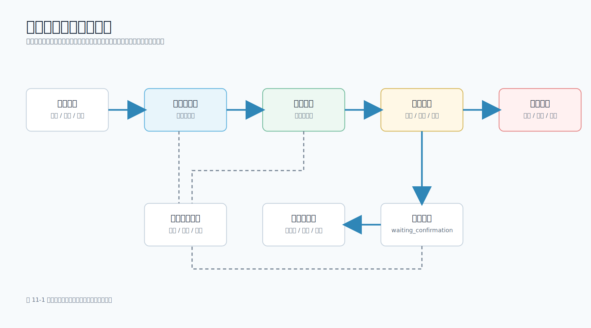

# 第 11 章 多工具调用与工作流编排

## 本章导读

第 10 章讲了 Agent：系统根据当前状态动态选择下一步工具。真实企业应用中，并不是所有复杂任务都应该交给 Agent 自由规划。很多场景的步骤本来就很清楚：收集数据、校验字段、生成草稿、等待确认、执行发布、记录结果。这样的任务更适合工作流（Workflow）。

工作流的价值是把确定性步骤固定下来，把不确定的语言任务交给模型，把高风险动作交给人工确认。对移动端开发工程师来说，这种设计更容易落地：App 可以明确展示“正在收集数据”“草稿已生成”“等待你确认”“已发布”“已取消”等状态，服务端也能记录每一步工具调用和审批结果。

图 11-1 展示了一个移动端团队周报工作流。



本章配套新增 `scripts/weekly_report_workflow.py` 和 `data/workflow/weekly_report_inputs.json`。脚本会读取任务、会议、代码提交、风险和下周计划，生成周报草稿；默认停在 `waiting_confirmation`，只有显式传入 `--approve --out <path>` 后才会写出文件。这个示例不调用真实模型，但保留了工作流编排中最重要的结构：固定节点、校验、草稿生成、人工确认、发布动作和执行步骤记录；生产系统还应把审计日志持久化。

## 学习目标

- 区分 Workflow、Agent 和 RAG（检索增强生成）各自解决的问题。
- 设计多个工具之间的固定调用顺序，并明确每个节点的输入和输出。
- 知道哪些节点适合模型生成，哪些节点必须由代码、规则或人工确认控制。
- 能够运行配套工程中的周报工作流脚本，观察确认门禁和发布状态。
- 掌握移动端页面如何展示工作流状态、确认页、取消和失败重试。

## 核心内容

### 11.1 Workflow 与 Agent 的边界

Workflow 是预先定义好的流程，适合步骤清晰、规则稳定、需要审计的任务。这里的 Workflow 指服务端预定义的业务编排，不是模型自行决定步骤。Agent 适合步骤不确定、需要根据中间结果动态选择下一步的任务。

可以用下面的判断方式区分：

| 问题 | 更适合 Workflow | 更适合 Agent |
| --- | --- | --- |
| 步骤是否固定 | 是，节点和顺序比较稳定 | 否，下一步取决于中间结果 |
| 是否需要审计 | 强，需要记录每个节点 | 也需要，但轨迹更动态 |
| 是否有高风险动作 | 常见，需要确认门禁 | 必须限制工具和人工确认 |
| 失败后如何恢复 | 可从指定节点重试 | 需要恢复状态和重新规划 |
| 移动端展示 | 状态明确，容易做进度条 | 需要展示更细的执行轨迹 |

例如“生成并发送周报”通常不需要 Agent 自由决定流程。它的步骤可以固定为：

1. 读取任务。
2. 读取会议结论。
3. 读取代码提交摘要。
4. 生成草稿。
5. 校验必填章节。
6. 等待人工确认。
7. 发布或写入协作工具。

其中第 4 步可以由模型生成，第 6 步必须由人确认，第 7 步必须由服务端执行。模型不应该直接绕过确认页发送消息。

### 11.2 Workflow、Agent 与 RAG 的关系

初学者容易把 Workflow、Agent 和 RAG 混在一起。它们经常组合出现，但解决的问题不同。

| 类型 | 主要问题 | 输入 | 输出 | 移动端关注点 |
| --- | --- | --- | --- | --- |
| Workflow | 固定流程如何编排、确认和恢复 | 表单、业务数据、流程状态 | 草稿、确认页、发布结果 | 进度、确认、取消、重试 |
| Agent | 下一步工具如何动态选择 | 目标、工具列表、当前状态 | 工具调用轨迹、最终报告 | 执行轨迹、停止条件、权限 |
| RAG | 回答时如何使用外部资料 | 用户问题、知识库、检索结果 | 带引用的回答 | 引用卡片、可信来源、反馈 |

周报生成是一个典型 Workflow：先收集数据，再生成草稿，再等待确认，最后发布。它可以包含一个模型节点，但不需要 Agent 自由决定流程。客服知识助手则可能先用 RAG 检索 FAQ 和历史工单，再进入“生成回复草稿、客服确认、发送回复”的 Workflow。Agent 也可以作为 Workflow 中的一个受控节点，例如“分析失败日志并提出 3 个排查动作”，但它的工具权限、最大步数和停止条件仍要由外层流程控制。

从移动端体验看，Workflow 更像一个可恢复的业务流程，RAG 更像一个带证据的回答能力，Agent 更像一个需要展示执行轨迹的自动化助手。把三者边界分清，页面状态、权限控制和失败恢复都会更清楚。

### 11.3 多工具调用不等于 Agent

多工具调用是指一个任务需要调用多个工具，例如任务系统、会议系统、代码仓库、通知工具。它不一定是 Agent。

如果工具调用顺序固定，就是工作流：

```text
get_tasks -> get_meetings -> get_commits -> build_draft -> confirm -> publish
```

如果工具调用顺序由模型根据中间结果动态选择，才更接近 Agent：

```text
观察当前结果 -> 选择工具 -> 读取结果 -> 判断是否继续
```

移动端工程中，很多看起来“智能”的功能其实更适合固定工作流。比如发布前检查、隐私评审、周报生成、工单创建、通知发送，这些任务的核心风险不是“模型不够聪明”，而是“流程是否可控、状态是否可恢复、发布是否经过确认”。

### 11.4 工作流节点设计

一个工作流节点至少要定义 6 件事：

| 字段 | 含义 |
| --- | --- |
| 节点名称 | 例如 `collect_inputs`、`build_draft`、`human_confirmation` |
| 输入 | 上一个节点输出、用户参数、系统数据 |
| 输出 | 草稿、校验结果、发布结果 |
| 失败条件 | 缺字段、权限不足、工具超时 |
| 风险等级 | 只读、生成草稿、写入系统、发送通知 |
| 是否需要确认 | 高风险或不可撤销动作必须确认 |

配套脚本用 `WorkflowStep` 记录节点：

```python
@dataclass(frozen=True)
class WorkflowStep:
    name: str
    status: str
    detail: str
    requires_confirmation: bool = False
```

这个结构虽然简单，但已经能支撑移动端页面展示：节点名称用于显示当前步骤，`status` 用于渲染状态，`detail` 用于提示用户，`requires_confirmation` 用于决定是否展示确认页。

### 11.5 输入收集与字段校验

工作流的第一步通常不是调用模型，而是收集和校验输入。周报工作流需要的数据包括：

- `tasks`：任务标题、状态、平台和影响。
- `meetings`：会议主题和结论。
- `commits`：代码仓库和提交摘要。
- `risks`：风险和阻塞。
- `next_week`：下周计划。

脚本中的校验逻辑如下：

```python
def collect_inputs(payload: dict) -> dict:
    user_id = _required_str(payload, "user_id")
    week = _required_str(payload, "week")
    normalized = {"user_id": user_id, "week": week}

    # 结构化列表必须逐项检查，不能只判断顶层是不是 list。
    normalized["tasks"] = _required_object_list(payload, "tasks", ("title", "status", "platform", "impact"))
    normalized["meetings"] = _required_object_list(payload, "meetings", ("topic", "decision"))
    normalized["commits"] = _required_object_list(payload, "commits", ("repo", "summary"))
    normalized["risks"] = _required_string_list(payload, "risks")
    normalized["next_week"] = _required_string_list(payload, "next_week")
    return normalized
```

这段代码体现了一个原则：不要把脏数据直接交给模型。模型可以帮忙组织语言，但不能替代必填字段校验。否则模型可能把缺失数据“补得很像真的”，反而让错误更难发现。

### 11.6 模型节点：只负责适合生成的部分

周报中的自然语言草稿适合交给模型或模板生成。配套脚本为了避免依赖外部服务，使用确定性模板生成草稿：

```python
draft = build_draft(normalized)
steps.append(WorkflowStep("build_draft", "complete", "Generated a structured weekly report draft."))
```

真实项目中，这一步可以替换为模型调用。但替换时要保留 3 个边界：

1. 输入必须经过字段校验和脱敏。
2. 模型只生成草稿，不直接发布。
3. 草稿必须经过结构校验和人工确认。

对于移动端 App，模型节点的状态可以展示为“正在生成草稿”。如果生成失败，应允许重试这一节点，而不是从头重新收集所有数据。

### 11.7 校验节点：不要让模型草稿直接进入发布

草稿生成后，需要校验必填章节：

```python
def validate_workflow(data: dict, draft: str) -> dict:
    required_sections = ["## 本周完成", "## 进行中", "## 会议结论", "## 代码变化", "## 风险与阻塞", "## 下周计划"]
    missing = [section for section in required_sections if section not in draft]
    errors = list(missing)
    warnings = []

    for index, task in enumerate(data["tasks"]):
        for field in ("title", "status", "platform", "impact"):
            if not task[field].strip():
                errors.append(f"tasks[{index}].{field} must not be empty")

    if not any(risk.strip() for risk in data["risks"]):
        errors.append("risks must include at least one non-empty item")

    return {"ok": not errors, "errors": errors, "warnings": warnings}
```

这类校验不复杂，却非常重要。它能防止模型漏掉“风险与阻塞”“下周计划”等关键部分，也能避免结构化输入中混入空字段。对于更正式的流程，还可以加入：

- 字数范围校验。
- 是否包含敏感字段。
- 是否包含真实用户数据。
- 是否包含未经确认的承诺。
- 是否引用了不存在的任务或会议。

校验节点应由代码执行，不应只靠 Prompt 约束。

### 11.8 人工确认：高风险动作的门禁

发送周报、创建工单、修改配置、审批退款、推送通知都属于有副作用动作。模型可以准备草稿，但不能直接完成这些动作。

配套脚本默认停在确认门禁：

```json
{
  "status": "waiting_confirmation",
  "stop_reason": "approval_required"
}
```

只有同时传入 `--approve --out <path>` 后，才会写入本地文件：

```bash
python3 scripts/weekly_report_workflow.py --approve --out /tmp/weekly.md
```

只传 `--approve` 不传 `--out` 时，脚本返回 `dry_run`。这表示用户已经通过确认门禁，但当前运行没有真实发布目标，所以不会写文件，也不会模拟外发消息。

移动端确认页至少应展示：

| 字段 | 说明 |
| --- | --- |
| 操作类型 | 发送周报、创建工单、发送通知 |
| 草稿内容 | 模型生成或模板生成的正文 |
| 接收对象 | 团队频道、用户、工单系统 |
| 风险提示 | 是否包含隐私、是否会外发 |
| 操作按钮 | 确认、取消、返回修改 |

用户点击确认后，服务端仍要重新校验权限和参数。确认页是用户交互门禁，不是安全系统的替代品。

### 11.9 工作流状态与移动端页面

工作流适合移动端展示，因为状态相对稳定。可以使用以下状态：

| 状态 | 含义 | 页面表现 |
| --- | --- | --- |
| `running` | 正在执行节点 | 显示进度和当前步骤 |
| `waiting_confirmation` | 等待人工确认 | 展示确认页 |
| `complete` | 流程完成 | 展示结果和引用/日志 |
| `dry_run` | 已确认但未执行真实发布 | 展示草稿和“未写入”提示 |
| `failed` | 节点失败 | 展示错误、允许重试 |
| `cancelled` | 用户取消 | 停止后续节点 |

页面状态对象可以设计为：

```json
{
  "workflow_id": "weekly_2026_w25",
  "state": "waiting_confirmation",
  "current_step": "human_confirmation",
  "can_retry": false,
  "can_cancel": true,
  "requires_confirmation": true
}
```

这样，iOS、Android、Flutter 或 React Native 页面只需要根据状态渲染，不需要理解服务端内部每个工具细节。

### 11.10 失败重试与幂等性

工作流比一次性模型调用更需要考虑重试。常见失败包括：

- 任务系统不可用。
- 会议纪要缺失。
- 模型生成超时。
- 校验失败。
- 用户取消。
- 发布工具返回错误。

重试时要避免重复发布。比如周报已经发送到团队频道，再次点击重试不应该发送第二份。生产系统通常会给每次工作流分配 `workflow_id`，给每个发布动作分配 `idempotency_key`，服务端用它判断是否已经执行过。

配套脚本只在 `--approve --out` 同时存在时写文件。没有 `--approve` 时，它停在确认状态；有 `--approve` 但没有 `--out` 时，状态返回 `dry_run`，`published_to` 为 `dry-run`。这让读者可以安全运行示例，不会误写真实系统。

## 动手实践

### 11.11 运行周报工作流

进入配套工程：

```bash
cd examples/mobile-knowledge-assistant
```

默认运行：

```bash
python3 scripts/weekly_report_workflow.py
```

典型摘要：

```json
{
  "status": "waiting_confirmation",
  "stop_reason": "approval_required"
}
```

这说明流程已经生成草稿并完成校验，但还没有发布。

如果只批准、不提供输出路径：

```bash
python3 scripts/weekly_report_workflow.py --approve
```

输出会进入安全的空跑状态：

```json
{
  "status": "dry_run",
  "stop_reason": "dry_run",
  "published_to": "dry-run"
}
```

批准并写出报告：

```bash
python3 scripts/weekly_report_workflow.py \
  --approve \
  --out /tmp/mobile-ai-weekly.md
```

输出会变成：

```json
{
  "status": "complete",
  "stop_reason": "published"
}
```

这里的 `/tmp/mobile-ai-weekly.md` 只是本地文件，用来模拟“发布动作”。真实项目中，发布动作可能是写入飞书文档、发送到企业微信或 Slack 频道、创建工单，或者更新团队后台中的周报记录。

### 11.12 读懂步骤列表

脚本输出中的 `steps` 类似下面这样：

```json
[
  {"name": "collect_inputs", "status": "complete"},
  {"name": "build_draft", "status": "complete"},
  {"name": "validate_draft", "status": "complete"},
  {"name": "human_confirmation", "status": "waiting", "requires_confirmation": true}
]
```

这个列表可以直接映射到移动端进度条或时间线组件。比起让用户只看到一个旋转加载状态，展示步骤能显著降低不确定感。

### 11.13 把周报工作流改造成工单工作流

周报工作流可以迁移到客服工单场景：

| 周报节点 | 工单节点 |
| --- | --- |
| 读取任务 | 读取用户问题和上下文 |
| 读取会议结论 | 检索 FAQ 和历史工单 |
| 生成周报草稿 | 生成工单分类和回复建议 |
| 校验必填章节 | 校验分类、优先级和引用依据 |
| 人工确认 | 客服确认回复内容 |
| 发布周报 | 创建工单或发送回复 |

关键原则不变：模型生成建议，工作流控制流程，人工确认高风险动作。

## 本章小结

工作流编排是企业级大模型应用的基础能力。它不追求“让模型自由行动”，而是把确定性步骤、模型生成节点、校验节点、人工确认和发布动作组织成可观察、可恢复、可审计的流程。

对移动端开发工程师来说，Workflow 的优势是状态清晰、页面好设计、失败可重试、风险可控制。Agent 适合动态探索，Workflow 适合稳定交付。真正可靠的大模型应用，往往是两者结合：用 Workflow 控制主流程，用模型处理语言生成和理解，用人工确认守住高风险边界。

## 实践练习

1. 修改 `data/workflow/weekly_report_inputs.json`，增加一个未完成任务，观察草稿中的“进行中”章节。
2. 删除 `risks` 字段后运行脚本，观察输入校验如何失败。
3. 将 `--out` 指向临时目录，确认在已提供 `--out` 时，只有同时传入 `--approve` 才会写出文件。
4. 设计一个客服工单分类工作流，列出每个节点的输入、输出和失败条件。
5. 为“发送用户通知”工具设计确认页字段，并说明服务端还需要做哪些权限校验。
