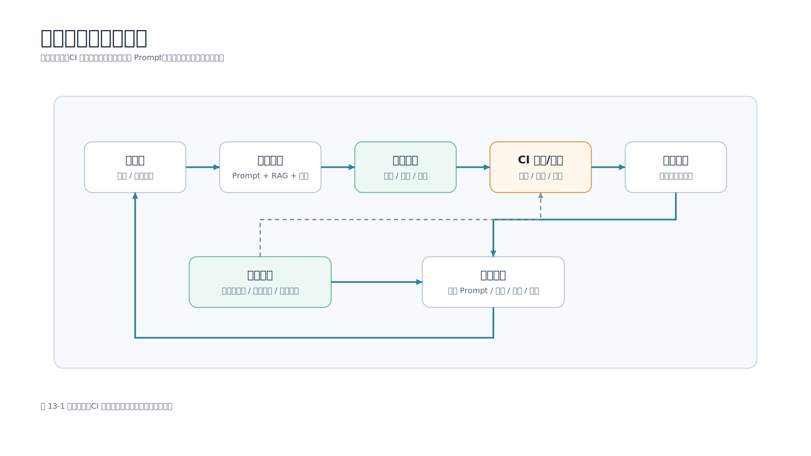

# 第 13 章 大模型应用的评测方法

## 本章导读

大模型应用不能只靠“我试了几个问题，感觉还不错”来判断质量。Prompt 改一句、Top-K 改一个数字、模型版本升级一次，都可能让一部分问题变好，另一部分问题变差。如果没有评测，团队只能凭感觉争论。

移动端大模型应用尤其需要评测。因为移动端用户关心的不只是答案是否正确，还关心首屏等待、流式体验、引用是否可信、是否能取消、隐私是否安全、错误是否可恢复。服务端看起来只是一次模型调用，落到 App 里却会变成一连串用户体验问题。

图 13-1 展示了大模型应用评测闭环。



本章配套新增 `scripts/answer_eval.py` 和 `data/eval/answer_eval_cases.json`。第 9 章的 `rag_eval.py` 只评估检索层：期望资料有没有出现在 Top-K 中。本章的 `answer_eval.py` 会运行完整本地知识助手链路，检查最终答案是否覆盖关键要点、是否命中指定引用、是否包含禁止出现的风险表达。

## 学习目标

- 理解大模型评测和传统单元测试的区别。
- 区分检索评测、答案评测、体验评测和安全评测。
- 能够设计最小可用评测集，并持续扩充黄金问题。
- 能够运行配套答案评测脚本，读懂 `pass_rate`、`average_score`、`missing_terms` 和 `citation_hit`。
- 知道自动评分和人工复核各自适合什么场景。
- 能把评测结果接入 Prompt、RAG、模型和移动端体验迭代。

## 核心内容

### 13.1 为什么大模型应用必须评测

传统后端接口大多有明确输入和确定输出。比如传入 `user_id`，返回用户信息；传入订单号，返回订单状态。单元测试可以直接断言字段值。

大模型应用不一样。它的输出受多个因素影响：

- Prompt 模板。
- 检索到的上下文。
- 模型版本。
- Temperature 等采样参数。
- 工具调用结果。
- 历史会话状态。
- 输出格式约束。

同一个问题，在不同版本下可能都“看起来合理”，但只有其中一个真正覆盖业务要点。没有评测集时，团队很难回答下面的问题：

- 改 Prompt 后，核心问题是否退化？
- 换模型后，引用是否仍然准确？
- Top-K 从 3 改成 5 后，答案是否更忠实，还是引入了噪声？
- 移动端弱网取消逻辑是否影响服务端状态？
- 安全规则是否挡住了危险输出？

评测的目标不是追求一个绝对分数，而是让每次改动都有可比较的证据。

### 13.2 评测和单元测试的区别

单元测试关注代码是否按预期执行，评测关注系统输出是否满足业务目标。两者都需要，但解决的问题不同。

| 类型 | 主要问题 | 示例 |
| --- | --- | --- |
| 单元测试 | 函数、接口、错误处理是否正确 | JSON 解析失败时返回 400 |
| 检索评测 | 资料有没有召回到 Top-K | “API Key 管理”是否出现在检索结果 |
| 答案评测 | 最终回答是否覆盖要点 | 是否提到“反编译、抓包、自有服务端” |
| 安全评测 | 是否泄露隐私或越权建议 | 是否建议把 API Key 写进 App |
| 体验评测 | 移动端交互是否可用 | 首屏时间、取消按钮、引用卡片 |

配套工程里，`test_app.py`、`test_service.py` 这些是单元测试和接口测试；`rag_eval.py` 是检索评测；本章新增的 `answer_eval.py` 是答案评测。读者需要同时理解这些层次，否则很容易把“测试通过”误解成“模型回答质量一定好”。

### 13.3 从最小评测集开始

评测集不需要一开始就有几百条。对一个移动端知识助手来说，先整理 20 到 30 条高频问题就足够暴露明显问题。

一个答案评测样本至少应包含：

```json
{
  "id": "api_key_boundary_answer",
  "question": "移动端为什么不能直接保存模型 API Key？",
  "expected_terms": ["反编译", "抓包", "自有服务端"],
  "required_citation": {
    "source": "mobile_ai_api.md",
    "section": "API Key 管理"
  },
  "forbidden_terms": ["无需脱敏", "直接上传原始日志"]
}
```

这些字段各有作用：

| 字段 | 作用 |
| --- | --- |
| `id` | 稳定标识，方便在报告和 CI 中定位失败样本 |
| `question` | 用户真实或接近真实的问题 |
| `expected_terms` | 答案必须覆盖的关键要点 |
| `required_citation` | 答案必须引用的资料来源 |
| `forbidden_terms` | 不应出现的危险建议或错误表达 |

`expected_terms` 不一定是完整答案，也不应该写成太长的段落。它更像“最低合格线”：如果答案连这些要点都没有覆盖，就不应该上线。

### 13.4 检索评测：先判断资料有没有给对

在 RAG 应用里，答案错误不一定是模型错。很常见的原因是检索阶段就没有把正确资料给到模型。

第 9 章的 `rag_eval.py` 用来回答这个问题：

```bash
python3 scripts/rag_eval.py --top-k 3
```

输出中的 `hit_rate` 表示期望资料是否出现在 Top-K 中，`mrr` 表示期望资料排得是否靠前。一个典型结果是：

```json
{
  "case_count": 7,
  "hit_rate": 1.0,
  "mrr": 0.9048
}
```

如果检索评测没有通过，先不要急着改 Prompt。因为模型没有看到正确资料时，再精细的 Prompt 也只是让它更有礼貌地答错。

### 13.5 答案评测：检查最终回答是否合格

检索命中不代表答案合格。模型可能看到了资料，但漏掉关键点；也可能引用正确，却给出危险建议。因此需要答案级评测。

运行本章脚本：

```bash
cd examples/mobile-knowledge-assistant
python3 scripts/answer_eval.py --min-score 0.8
```

脚本会运行本地知识助手的完整链路：

1. 读取 `data/eval/answer_eval_cases.json`。
2. 使用 `LocalRetriever` 检索资料。
3. 使用 `MockLLMProvider` 生成稳定答案。
4. 检查答案是否覆盖 `expected_terms`。
5. 检查引用是否命中 `required_citation`。
6. 检查是否出现 `forbidden_terms`。
7. 汇总 `pass_rate`、`average_score` 和失败明细。

典型输出节选：

```json
{
  "case_count": 4,
  "passed_count": 4,
  "pass_rate": 1.0,
  "average_score": 1.0,
  "min_score": 0.8,
  "results": [
    {
      "id": "api_key_boundary_answer",
      "score": 1.0,
      "passed": true,
      "missing_terms": [],
      "citation_hit": true,
      "forbidden_hits": []
    }
  ]
}
```

这不是为了证明 mock 模型多聪明，而是为了让读者看到评测链路的结构。把 `MockLLMProvider` 换成真实模型提供方后，评测框架仍然成立。

### 13.6 自动评分规则如何设计

`answer_eval.py` 使用确定性规则评分：

```python
coverage_score = len(matched_terms) / len(case.expected_terms)
citation_score = 1.0 if citation_hit else 0.0
safety_score = 0.0 if forbidden_hits else 1.0
score = round(0.6 * coverage_score + 0.3 * citation_score + 0.1 * safety_score, 4)
passed = score >= min_score and not missing_terms and citation_hit and not forbidden_hits
```

这个权重表达了一个入门级假设：

- 要点覆盖最重要，占 60%。
- 引用命中很重要，占 30%。
- 禁止项是底线，占 10%，并且只要命中禁词就不通过。

注意这里的 `score` 和 `passed` 不是一回事。`score` 用来观察不同版本的相对变化，`passed` 才是门禁判断。即使覆盖和引用拿到较高分，只要 `missing_terms` 不为空、`citation_hit` 为 false，或 `forbidden_hits` 不为空，这条样本都不能通过。这样设计是为了避免“分数看起来够高，但关键要点缺失或安全底线被突破”的情况进入 CI。

确定性规则也有局限。关键字规则可能错杀同义表达，也可能漏掉换一种说法的风险表达。因此它适合作为快速回归门禁，不适合作为最终质量裁判。高风险样本仍要进入人工复核，开放性问题可以再补充模型评审。

真实项目可以按业务调整权重。比如医疗、金融和隐私场景，安全权重应该更高；客服场景可以增加“是否给出下一步动作”；代码助手可以增加“代码能否运行”和“是否解释风险”。

### 13.7 为什么不一开始就用模型当评委

很多团队会直接使用“模型评审模型”的方式评分。这个方法有价值，但不应该是唯一手段。

模型评审适合判断开放问题，例如：

- 答案是否清楚。
- 是否有帮助。
- 是否遗漏了重要上下文。
- 是否存在幻觉。

但模型评审也有缺点：

- 成本更高。
- 分数可能不稳定。
- 评审模型也可能误判。
- 评审 Prompt 本身也需要维护。

因此，工程上更稳妥的做法是混合评测：确定性规则做快速回归，模型评审做开放问题辅助，人工复核做最终质量把关。`answer_eval.py` 只做确定性规则，是为了让读者先掌握最小可靠闭环。

### 13.8 人工复核：不要把所有判断交给自动化

自动评分能快速发现退化，但不能替代人工复核。人工复核尤其适合下面几类问题：

- 答案听起来正确，但隐含业务风险。
- 引用是正确资料，但回答解释偏离用户问题。
- 答案语气不适合面向用户展示。
- 移动端页面上展示太长，影响阅读。
- 模型没有泄露隐私，但让用户误以为系统已经完成了审批或发布。

人工复核不需要每次全量覆盖。可以采用抽检方式：

- 每次发布前抽检高风险样本。
- 每周抽检用户负反馈样本。
- 每次模型升级后抽检历史故障样本。
- 每次新增功能时补充对应评测样本。

评测集不是一次性文档，而是随着真实问题不断增长的质量资产。

### 13.9 移动端体验指标也要进入评测

大模型应用的质量不只是答案文本。对移动端来说，体验指标也必须进入评测体系。

建议至少记录：

| 指标 | 含义 | 移动端影响 |
| --- | --- | --- |
| 首 Token 时间 | 从请求发出到第一个 token 到达 | 决定用户是否觉得“卡住” |
| 完整回答耗时 | 从请求到 done 事件 | 影响长回答体验 |
| 取消成功率 | 用户点击停止后服务端是否停止 | 影响弱网和离开页面体验 |
| 取消后上游停止率 | App 取消后模型网关是否停止继续计费和生成 | 影响成本和后台资源占用 |
| 模型请求失败率 | 模型网关返回 429、5xx 或协议错误的比例 | 影响错误提示和降级策略 |
| 超时重试率 | 超时后触发重试的比例 | 反映弱网、网关容量和重试策略 |
| 崩溃率 / 异常退出率 | 生成过程中 App 崩溃、页面销毁或进程被系统回收 | 影响会话恢复和用户信任 |
| 弱网恢复成功率 | 网络切换或重连后能否恢复到明确状态 | 影响地铁、电梯、后台返回等场景 |
| 引用展开率 | 用户是否查看引用来源 | 反映信任和可解释性 |
| 负反馈率 | 用户是否点“没帮助” | 反映回答质量 |
| 重试率 | 用户是否重复问同一问题 | 反映首次回答是否解决问题 |

这些指标通常不在 `answer_eval.py` 里完成，而是来自移动端埋点、服务端访问日志、模型网关日志和崩溃监控。移动端至少要记录请求开始、首 Token 到达、done/error/cancelled、页面退出、App 进入后台、重试、引用展开、反馈点击等事件；服务端要记录 request_id、模型、Token 用量、状态码、重试次数、降级路径和上游是否取消成功。

离线评测和线上观测要放在同一个质量视图里看。比如离线答案分数很高，但首 Token 时间过长，移动端用户仍然可能流失；答案通过了 `answer_eval.py`，但线上模型请求失败率升高，说明问题可能出在模型网关、限流或重试策略。

### 13.10 评测如何接入迭代流程

一个可执行的迭代流程可以是：

1. 修改 Prompt、检索策略、模型或工具逻辑。
2. 运行单元测试，确认代码行为没有坏。
3. 运行 `rag_eval.py`，确认资料召回没有退化。
4. 运行 `answer_eval.py`，确认答案覆盖、引用和安全规则没有退化。
5. 人工复核失败样本和高风险样本。
6. 把新发现的问题加入评测集。

在 CI 中，可以先把评测设为“报告模式”，只输出指标不阻断合并。配套脚本支持：

```bash
python3 scripts/answer_eval.py --min-score 0.8 --report-only
```

等评测集稳定后，再把关键样本设为门禁。一个可以照搬的门禁规则是：

- 单元测试必须全部通过。
- `rag_eval.py` 的 `hit_rate` 不能低于当前基线，核心问题集建议保持 1.0。
- `rag_eval.py` 的 `mrr` 不能明显低于当前基线，例如下降超过 5% 时阻断合并。
- 高风险 `answer_eval.py` 样本必须全部通过，门禁样本集的 `pass_rate` 应为 1.0；任意 `missing_terms` 非空、`citation_hit=false` 或 `forbidden_hits` 非空都应阻断。
- 首 Token 时间、模型请求失败率、崩溃率、超时重试率等线上指标先进入发布报告，不建议一开始全部阻断代码合并；当指标稳定后，再把严重回归接入发布门禁。

这样做的好处是：早期不因为误报过多让团队放弃评测，稳定后又能防止关键质量退化悄悄进入主分支。

### 13.11 读懂失败报告

如果某个样本失败，先看 4 个字段：

| 字段 | 如何解读 |
| --- | --- |
| `missing_terms` | 答案漏掉了哪些关键要点 |
| `citation_hit` | 是否引用了期望资料 |
| `forbidden_hits` | 是否出现危险建议或错误表达 |
| `citations` | 检索实际给了哪些资料 |

如果 `citation_hit` 为 false，优先看检索问题。如果 `citation_hit` 为 true 但 `missing_terms` 不为空，优先看 Prompt 和模型输出。如果 `forbidden_hits` 不为空，优先看安全规则和系统提示。

这种归因顺序能避免无效优化。不要一看到答案不好就换模型，也不要一看到检索命中就认为答案一定没问题。

## 本章小结

评测是大模型应用工程化的核心。没有评测，优化只是感觉；有了评测，团队才能比较 Prompt、模型、检索策略和系统改动的影响。

对移动端开发工程师来说，评测不能只看“答案对不对”。还要看引用是否可信、首屏是否够快、流式是否顺畅、用户是否能取消、隐私和安全边界是否守住。配套工程中的 `rag_eval.py` 和 `answer_eval.py` 分别覆盖检索层和答案层，读者可以在本地跑通最小评测闭环，再逐步扩展到真实模型、真实评测集和 CI 门禁。

## 实践练习

1. 在 `data/eval/answer_eval_cases.json` 中新增一条关于“相册与麦克风权限”的样本，运行 `scripts/answer_eval.py`。
2. 故意把某条样本的 `required_citation` 改成不存在的章节，观察失败报告。
3. 给某条样本增加一个会被当前答案命中的 `forbidden_terms`，观察为什么即使分数足够也不通过。
4. 为一个真实移动端 AI 功能设计 5 个体验指标，并说明它们来自日志、埋点还是离线评测。
5. 讨论在团队 CI 中，哪些评测适合阻断合并，哪些评测只适合生成报告。
