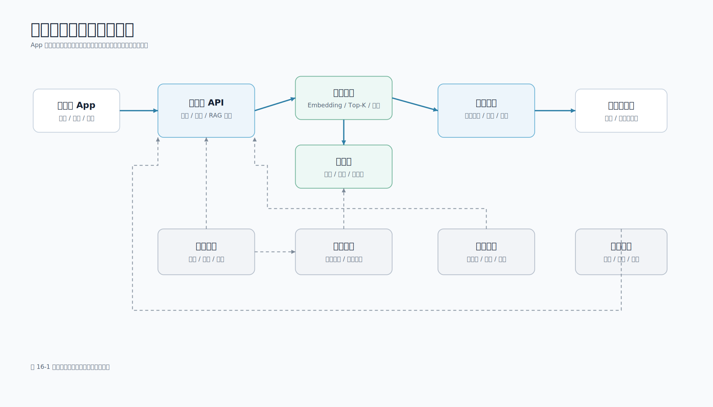

# 第 16 章 综合项目：构建移动端知识助手

## 本章导读

本章把全书知识串联起来，完成可运行的移动端知识助手。项目采用“移动端 App + Python 服务端 + 本地知识库 + RAG + 模型提供方”的结构，支持 JSON 问答、SSE、取消、工具调用、引用、Trace、评测和测试。

工程：`examples/mobile-knowledge-assistant/`



模型网关、向量库、任务队列、评测和监控属于生产补齐模块。当前工程实现 App 调用服务端、检索、Prompt、Provider 和测试。

## 学习目标

- 设计移动端知识助手端到端架构。
- 理解移动端、服务端、检索模块和模型提供方的职责边界。
- 运行并验证配套 Python 工程。
- 理解 JSON、SSE、取消、Prompt 契约、工具调用、RAG Trace 和评测的作用。
- 说清楚从本地示例走向生产系统还需要补齐哪些能力。

## 16.1 项目目标与边界

移动端知识助手用于帮助用户、移动端研发团队或内部支持团队查询知识库内容，例如 AI 接入规范、崩溃排查流程、隐私权限要求、流式输出规范和故障手册。

核心需求如下。

| 需求 | 本章工程如何支持 |
| --- | --- |
| 移动端不保存模型密钥 | 服务端从环境变量读取 `LLM_API_KEY` |
| 可无密钥运行 | 默认使用 `mock` Provider |
| 环境可自检 | `scripts/dev_environment_check.py` |
| Prompt 可测试 | `scripts/prompt_contract_check.py` |
| 基于知识库回答 | 本地 Markdown 检索 + RAG Prompt |
| 回答可追溯 | 返回 `citations` |
| 长回答体验可控 | SSE 流式接口 |
| 用户可停止生成 | 取消活跃流式请求 |
| 工具调用有边界 | `scripts/structured_tool_router.py` |
| 可调试 RAG 链路 | `scripts/rag_trace.py` |
| 代码真实可验证 | 单元测试和脚本编译检查 |

工程不训练自有模型，不在客户端保存密钥，不让模型绕过权限访问业务系统，不把隐私原文写入日志，也不把本地关键词检索包装成生产向量库。

## 16.2 系统架构

系统分为 7 个模块。

| 模块 | 职责 | 对应文件 |
| --- | --- | --- |
| 移动端 App | 提问、展示回答、追加流式片段、展示引用、发起取消 | 页面状态机 |
| 服务端 API | HTTP、JSON/SSE、稳定错误 | `src/mobile_llm/app.py` |
| RAG 服务层 | 检索、Prompt、模型调用、引用 | `src/mobile_llm/service.py` |
| 本地检索器 | 读取 Markdown、切分片段、计算分数 | `src/mobile_llm/retriever.py` |
| Prompt 构造器 | 明确资料边界，降低注入风险 | `src/mobile_llm/prompts.py` |
| 模型提供方 | 默认 mock，可切换 OpenAI-compatible | `src/mobile_llm/providers.py` |
| 测试与脚本 | 验证环境、接口、检索、评测、SSE 和工具调用 | `tests/`、`scripts/` |

移动端只调用自有服务端。服务端负责模型密钥、RAG 编排、Prompt、安全边界、错误码和日志。移动端承担交互体验和状态管理，不直接面对模型提供方。

## 16.3 启动项目

进入项目目录：

```bash
cd examples/mobile-knowledge-assistant
```

可选地创建虚拟环境：

```bash
python3 -m venv .venv
source .venv/bin/activate
```

启动服务：

```bash
PYTHONPATH=src python3 -m mobile_llm.app
```

健康检查：

```bash
curl -s http://127.0.0.1:8000/health
```

预期响应：

```json
{"status": "ok"}
```

默认服务绑定 `127.0.0.1`。如果改为 `0.0.0.0` 并接入真实模型，须先增加登录认证、限流、受控 CORS 来源和访问日志脱敏。

## 16.4 配置与密钥边界

配置加载逻辑在 `src/mobile_llm/config.py`。核心原则：模型 API Key 只在服务端读取，移动端不保存、不拼接、不转发。

切换真实模型：

```bash
export LLM_PROVIDER=openai_compatible
export LLM_API_URL=https://api.example.com/v1/chat/completions
export LLM_API_KEY=replace-with-real-key
export LLM_MODEL=example-chat-model
PYTHONPATH=src python3 -m mobile_llm.app
```

不要把真实密钥写入仓库，也不要写入书中截图。提交示例配置时只能使用占位符。

## 16.5 文档、检索与 RAG

示例知识库在 `data/documents/`，包含：

- `mobile_ai_api.md`：移动端 AI 接入指南。
- `crash_analysis.md`：崩溃日志分析助手。
- `privacy_review.md`：移动端隐私与权限审查。

服务层主流程：

```python
def answer(self, question: str, top_k: int = 3) -> dict:
    contexts = self.retriever.search(question, top_k=top_k)
    messages = build_rag_messages(question, contexts)
    answer = self.provider.generate(messages, contexts, question)
    return {
        "answer": answer,
        "citations": [_citation(item) for item in contexts],
    }
```

这段代码表达 3 个边界：检索先于生成；Prompt 构造单独封装；引用来源由服务端返回。移动端不根据答案文本猜引用，而是渲染 `citations`。

## 16.6 JSON、SSE 与取消

普通问答接口适合短回答：

```bash
curl -s http://127.0.0.1:8000/api/ask \
  -H 'Content-Type: application/json' \
  -d '{"request_id":"req_json_001","question":"移动端为什么不能直接保存模型 API 密钥？"}' \
  | python3 -m json.tool
```

长回答适合 SSE：

```bash
curl -N --get http://127.0.0.1:8000/api/ask/stream \
  --data-urlencode 'question=如何处理移动端流式输出' \
  --data-urlencode 'request_id=req_stream_001'
```

事件格式：

```text
event: token
data: {"type":"token","request_id":"req_stream_001","content":"..."}

event: done
data: {"type":"done","request_id":"req_stream_001","citations":[...]}
```

取消接口：

```bash
curl -s -X POST http://127.0.0.1:8000/api/ask/req_stream_001/cancel \
  | python3 -m json.tool
```

取消要区分三层：移动端停止接收、服务端停止继续发送、上游模型停止推理。本章示例能取消活跃流式请求并让服务端停止发送；生产系统是否能让上游推理立即停止，取决于模型网关或 SDK。

移动端状态机：

```text
idle -> submitting -> waiting_first_token -> streaming -> done
                         |                 |
                         v                 v
                      failed           cancelled
```

页面退出、用户点击停止、网络断开和新问题覆盖旧问题，都要明确处理旧 `request_id`。

## 16.7 客户端模拟器

配套工程提供 `scripts/sse_client.py`，模拟移动端状态机：连接 SSE、解析事件、追加 Token 和处理终态。

```bash
python3 scripts/sse_client.py \
  --question '如何处理移动端流式输出' \
  --request-id req_client_001
```

真实 iOS、Android、Flutter 或 React Native 项目可以把这段逻辑迁移为网络层和状态层代码。原则是：网络层解析事件，状态层决定 UI，页面层只根据状态渲染。

## 16.8 RAG Trace 与评测

当 RAG 回答不准确时，先看检索结果，而不是直接换模型。

```bash
python3 scripts/rag_trace.py --question '移动端为什么不能直接保存模型 API Key？'
```

Trace 输出用户问题、检索片段、Prompt 消息和 mock 答案。若 `retrieved_contexts` 为空，问题在检索召回；若召回错误章节，检查切分和索引；若资料正确但回答错误，再检查 Prompt、模型参数或输出校验。

检索回归使用：

```bash
python3 scripts/rag_eval.py --top-k 3
```

它只评估检索层，不证明最终答案一定正确。修改切分、排序或知识库导入后，应优先运行它。

## 16.9 Provider 与真实模型

默认 `MockLLMProvider` 让读者无需 API Key 即可运行。真实模型通过 `OpenAICompatibleProvider` 接入。它使用标准库 `urllib` 发起请求，并对网络错误、408、429 以及 500/502/503/504 做有限重试。认证错误、参数错误等确定性错误不应自动重试。

当前 `OpenAICompatibleProvider.stream_generate()` 是同步请求后的单块 fallback，用来保持 SSE 协议可运行。生产环境要获得真正逐 Token 返回，需要在 Provider 层启用模型网关的流式模式，并解析上游增量事件。

## 16.10 测试与质量门禁

运行测试：

```bash
PYTHONWARNINGS=error PYTHONPATH=src python3 -m unittest discover -s tests
```

还应运行脚本编译检查，确认 `src/mobile_llm/` 和 `scripts/` 中的示例代码都能被 Python 解释器加载。完整命令已在根目录 README 和 CI 中维护。

修改 Prompt、检索、Provider、SSE 协议或错误处理后，都应重新运行测试。

## 16.11 从示例到生产

生产系统还需补齐：登录态和文档权限；真实 Embedding、向量库、混合检索和重排；文档同步和版本管理；Prompt 灰度和回滚；模型网关路由、限流、重试和熔断；评测与人工复核；成本和延迟监控；脱敏、审计和注入防护；移动端加载、取消、引用和反馈。

权限过滤不能交给模型判断，必须在检索前执行。

## 16.12 验收清单

完成本章后，读者应能启动服务并通过 `/health`，请求 `/api/ask` 和 `/api/ask/stream`，理解取消接口的 `202 accepted` 与 `404 not_found`，运行环境检查、Prompt 契约检查、结构化工具路由、RAG Trace、RAG 评测、答案评测、运维报表和全部单元测试，并能说清楚从本地示例到生产系统还差哪些能力。

## 本章小结

移动端知识助手是大模型应用的典型项目，涵盖移动端接入、服务端 API、Prompt、结构化工具调用、检索、RAG、流式输出、引用来源、安全、测试和生产化改造。本章工程保持足够小，便于读者运行；同时保留真实工程边界，避免把模型密钥、权限判断、日志脱敏和错误处理这些关键问题简化掉。

## 实践练习

1. 用 5 篇团队内部已脱敏文档替换默认文档，并用 `rag_trace.py` 检查召回结果。
2. 为文档片段增加 `updated_at` 和 `visibility` 元数据。
3. 把 `LocalRetriever` 替换为真实 Embedding 和向量库，并保持 `/api/ask` 响应结构不变。
4. 为移动端引用卡片设计折叠态、展开态和“引用错误”反馈入口。
5. 实现真正的 OpenAI-compatible 上游流式解析。
